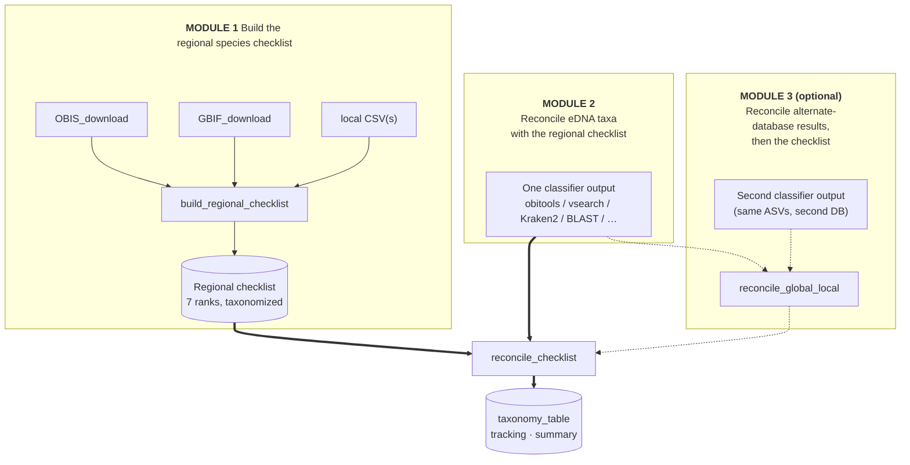

# REGATTA

<!-- badges: start -->
[](https://github.com/EWisely/REGATTA/actions/workflows/R-CMD-check.yaml)
<!-- badges: end -->

**Reconciling eDNA Geographic Assignments via Taxonomy Table Adjustment**

Global reference databases (NCBI, EMBL) are not geographically constrained, so a
classifier can confidently name a species that does not occur in your study
region — even within the group your primer targets (e.g. a freshwater fish
called from marine MiFish data). REGATTA reconciles such calls against a regional
species checklist it builds from public biodiversity databases (OBIS/GBIF) plus
any local lists: species-level calls with a regional record are kept, and
unsupported ones are downgraded only as far up the tree as the checklist
requires, rather than discarded. No manual reference-database curation, no
blanket percent-identity cutoff.

## Modules

A run is **Module 1 → Module 2** (one classifier) or **Module 1 → Module 3** (two
classifiers); Module 1 also runs standalone if you just want the species list.
`run_regatta()` drives Modules 2 and 3 — Module 3 only adds one optional step
(`reconcile_global_local()`, the dashed branch) in front of the shared checklist
reconciliation.

For each ASV, REGATTA finds the lowest rank shared by the assignment and the
checklist and downgrades only that far. Names on both sides pass through a
synonym-aware NCBI lookup, so outdated nomenclature (e.g. *Lagenorhynchus
obliquidens* → *Sagmatias obliquidens*) still matches.



## Installation

```r
# install.packages("devtools")
devtools::install_github("EWisely/REGATTA", build_vignettes = TRUE)
library(REGATTA)

vignette("REGATTA-tutorial")       # Modules 1 + 2 (one classifier)
vignette("REGATTA-two-database")   # Module 3 (global + local)
```

Vignettes need `pandoc` (bundled with RStudio); drop `build_vignettes = TRUE`
without it.

## Setup

- **Taxonomy database.** Module 1, and any classifier output not already resolved
  to the 7 ranks, need a local NCBI taxonomy snapshot (`taxonomizr`). It is built
  on first use into a per-user cache (`tools::R_user_dir("REGATTA", "cache")`,
  ~few hundred MB) and reused across projects. Point `sql_path` at an existing DB
  to reuse one; `overwrite_taxonomy_files = TRUE` refreshes it. The core
  reconciliation on a pre-taxonomized checklist + pre-resolved table needs no DB.
- **GBIF** (only if `GBIF = TRUE`). Needs a free
  [GBIF account](https://www.gbif.org/user/profile); put `GBIF_USER` / `GBIF_PWD`
  / `GBIF_EMAIL` in `.Renviron` (`usethis::edit_r_environ()`, then restart R). A
  fresh download takes several minutes.
- **Polygon.** Draw one at [wktmap.com](https://wktmap.com) and copy the WKT
  `POLYGON ((long lat, ...))` string for `regional_poly`.
- **Output.** `build_regional_checklist(output_dir=)` and `run_regatta(out_dir=)`
  are required; each run writes a dated `<region>_<label>_<Date>` subfolder and
  also returns the results as R objects.
- `resolve_taxa()` pre-checks group names before a long download. Shorthands:
  `"fish"` (ray-finned + sharks/rays/hagfish/lampreys) and `"vertebrates"`.

## Module 1 — build the regional checklist

Run once per region × group.

```r
poly <- "POLYGON ((-117.4 32.0, -91.9 -6.3, -81.4 -6.3, -76.1 7.7, -82.1 8.6, -104.2 20.3, -112.5 32.2, -117.4 32.0))"

cl <- build_regional_checklist(
  region        = "galapagos",   # names the output files
  label         = "fish",        # short filename label
  taxa          = "fish",        # query for the downloaders
  regional_poly = poly,
  OBIS          = TRUE,          # primary source (default)
  GBIF          = FALSE,         # TRUE = fresh download, or pass a key/object to reuse one
  CSV           = NULL,          # optional path(s) to your local checklist CSV(s)
  marine        = TRUE, terrestrial = FALSE,
  output_dir    = "local_database_checklist"   # REQUIRED (dated subfolder written here)
  # sql_path defaults to the per-user cache; pass a path to reuse an existing DB.
)

cl$for_LCA             # taxID + 7 ranks -> hand to run_regatta(checklist = cl$for_LCA)
cl$for_making_localdb  # bare species vector, also written CRABS-ready one-per-line
cl$checklist_summary   # full taxonomized audit table
cl$methods             # provenance sentence + live citations (incl. any GBIF key/DOI; verify them)
```

Build a separate checklist per primer target (fish list for fish, etc.) so
genuine off-target amplifications stay visible. Nothing is fish-, marine-, or
Galapagos-specific.

## Module 2 — reconcile one classifier

`run_regatta()` auto-detects the format, runs the checklist reconciliation, and
returns the tables (also written under `out_dir`). Use the same `region`/`label`
as Module 1.

```r
res <- run_regatta(
  input     = "data/MiFish_obi.tab",              # any tool; or a vsearch pair:
  #           c("data/vs_lca.txt", "data/vs_userout.txt")
  checklist = "local_database_checklist/my_regional_checklist.rds",
  out_dir   = "regatta_out", region = "galapagos", label = "fish"
)

res$taxonomy_table   # final table: ASV_id, pct_id, 7 ranks
res$tracking         # per-ASV before/after audit
res$summary          # per-stage stats
```

## Module 3 — reconcile a global + local database, then the checklist

Pass the same ASVs classified two ways as a named `list(global =, local =)`.
`run_regatta()` runs `reconcile_global_local()` first (per ASV it keeps the
higher-percent-identity call, but when the **global** call wins yet the **local**
one disagrees it downgrades to the LCA of the two; a local win is kept), then the
Module 2 checklist step. Roles come from the list, never from filenames; either
side may be a vsearch `lca + userout` pair.

```r
res <- run_regatta(
  input = list(
    global = "data/obi.tab",                              # broad global DB
    local  = c("data/vs_lca.txt", "data/vs_userout.txt")  # locally-curated DB
  ),
  checklist = "local_database_checklist/my_regional_checklist.rds",
  out_dir   = "regatta_out", region = "galapagos", label = "fish"
)
```

A two-DB `res$summary` has four stage columns (`global`, `local`,
`regatta_global_local_result`, `regatta_checklist_result`); `res$tracking` shows
each field's global / local / reconciled value side by side.

## Functions

| Function | Module | Purpose |
|---|---|---|
| `resolve_taxa()` | 1 | Pre-check/disambiguate query taxon names (WoRMS); report GBIF coverage. |
| `OBIS_download()` / `GBIF_download()` | 1 | Pull a species list from OBIS / GBIF for taxa within a WKT polygon. |
| `build_regional_checklist()` | 1 | **Checklist entry point.** OBIS/GBIF + local CSVs → taxonomized list; returns `for_LCA`, `for_making_localdb`, `checklist_summary`, `methods`. |
| `taxonomize_checklist()` | 1 | Resolve a species list to a 7-rank NCBI table (synonym-aware). Usually called for you. |
| `run_regatta()` | 2 / 3 | **Entry point for Modules 2 & 3.** Auto-detect format → reconcile → return `taxonomy_table` + `tracking` + `summary`. |
| `reconcile_checklist()` | 2 | Core LCA step: one table vs. the checklist. `$result` / `$tracking` / `$stats`. |
| `reconcile_global_local()` | 3 | Merge two classifier outputs (higher pct-id wins; LCA when global wins but local disagrees). |
| `summarize_regatta()` | 2 / 3 | Per-stage stats summary (counts, checklist membership, specificity, transitions). |
| `parse_vsearch_results()` / `parse_vsearch_userout()` / `parse_sintax()` | 2 / 3 | vsearch/SINTAX preprocessors → 7 rank columns. |
| `resolve_taxids()` / `resolve_names()` | 2 / 3 | NCBI taxIDs or scientific names → 7 rank columns. |

The reconcile steps each return `$result` (the exchange format: `ASV_id`,
`pct_id` normalized to 0–100, then the 7 ranks — drop `pct_id` for a phyloseq
`tax_table()`), `$tracking` (per-ASV audit), and `$stats`. CSVs are written only
when an output dir is given.

## Caveats

- The checklist is only as good as its sources: names in your CSVs that don't
  resolve in NCBI can never match (NCBI-canonical) classifier output.
- Rank set is fixed at 7 levels (`domain` … `species`); no subspecies/superkingdom.

## Status

Ready for release. Function names and signatures are stable; heading toward a
CRAN submission and a companion methods paper.

## Authors

Eldridge Wisely (Scripps Institution of Oceanography, UC San Diego), developer
and maintainer, with contributions from Ella Crotty (generalizing the OBIS/GBIF
download functions and the summary output format).

## AI Usage Statement

This package started as an R script that Eldridge Wisely wrote and used for 2
years before using Claude Code (Opus 4.8) to create the package from the working
code base. Eldridge and Ella tested the package on their own datasets before and
after Claude was used to verify that the behavior of the code didn't change.

## License

MIT (see `LICENSE`).
