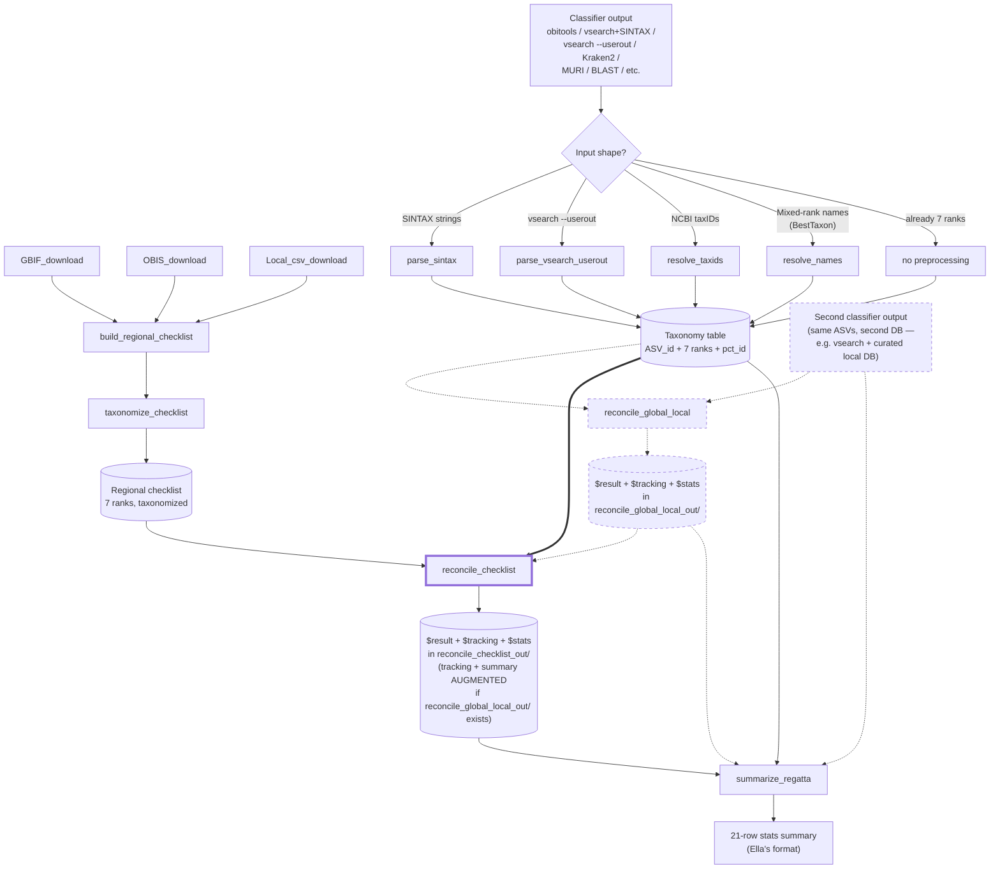

# REGATTA

**Reproducible Eco-Geographic Assignment Through Taxonomic Adjustment**

An R package (in development) for correcting off-target species assignments in
eDNA metabarcoding results using a regional species checklist, without manual
curation and while preserving as much taxonomic specificity as possible.

## The problem

Global reference databases (NCBI, EMBL, etc.) confidently assign eDNA reads
to species that don't actually live in your study area, because the closest
match in the database is a relative from somewhere else in the world. The
usual fixes — hand-curating a local reference database, or applying a flat
percent-identity cutoff — are either non-reproducible or sacrifice
specificity unnecessarily.

## The fix

REGATTA pulls a regional species list from public biodiversity sources
(GBIF, OBIS, plus any local CSVs you have), resolves it to NCBI taxonomy,
and uses it as a sanity filter on each ASV's classification. For each
assigned ASV, REGATTA finds the **lowest taxonomic rank shared between
the assignment and the regional checklist** and downgrades only that far.

A *Sebastes mystinus* call in a region that has *S. mystinus* on the
checklist stays at species. A call to *S. goodei* (a Pacific rockfish) in
a region whose checklist has other *Sebastes* but not *S. goodei* is
downgraded to genus *Sebastes* and flagged. A call to a tropical species
in a temperate-region checklist with no *Sebastes* at all gets walked up
the tree until something matches, or flagged as fully off-target if
nothing does.

### Method advantages

- **Synonym-aware name lookup.** Classifier outputs and regional
  checklists are routed through a synonym-aware NCBI lookup. Names that
  reflect older nomenclature get **automatically updated to the current
  canonical taxonomy** during preprocessing — e.g. *Lagenorhynchus
  obliquidens* → *Sagmatias obliquidens* (recent cetacean revision),
  *Antennarius sanguineus* → *Abantennarius sanguineus* (frogfish genus
  split), *Caranx ruber* → *Carangoides ruber* (jack revision). This
  normalizes both the classifier output and the regional checklist to
  the same canonical names, so a synonym on either side still matches
  in the LCA walk. Each row's `name_match_type` column flags whether
  the name resolved as a canonical scientific name or via a synonym,
  so the downstream summary report can distinguish "this name was
  updated to current taxonomy" from a checklist-based downgrade.
- **No manual curation.** The whole pipeline is deterministic and
  scriptable. Given the same inputs (source CSVs, regional polygon,
  NCBI taxonomy snapshot), the same outputs come back.
- **Specificity-preserving.** Downgrades only happen when the
  checklist forces them. No flat percent-identity cutoffs that throw
  away species-level information unnecessarily.

### Works for any group, any region

The examples in this README and the validated worked dataset
(`stress_test_galapagos_crustaceans.R`, `end_to_end_raw_galapagos.R`)
use marine fish and crustaceans in the Galapagos because that's what
the package was developed against. **Nothing in the pipeline is
fish-, marine-, or Galapagos-specific.** Use it for freshwater insects
in Germany, terrestrial mammals in the Sonoran Desert, soil microbiota
in Antarctica, or any other group × region combination. The only
per-region work is building and taxonomizing the regional species
checklist; every downstream function is taxonomy- and
geography-agnostic, and the function defaults (output folder names,
exchange-format columns, etc.) carry no group label so a user can run
multiple groups side-by-side in the same project without renaming
collisions.

Treat the file-name pattern `comprehensive_<region>_<group>_list.txt`
(and its `*_taxonomized.rds` companion) as a useful convention rather
than a requirement — pick whatever names suit your project.

## Pipeline

**Reading the diagram:** the **core REGATTA workflow** (solid arrows)
runs one classifier output through `reconcile_checklist()`. The
**optional `reconcile_global_local()` branch** (dashed arrows + dashed
nodes) is a side-path you take only if you also have a second classifier
output for the same ASVs — its `$result` is the same shape as the direct
taxonomy table, so it slots in as an optional preprocessing step before
`reconcile_checklist()`.



## Setup

### Project structure

Create an R project. In its working directory, make two folders:

- `datasets/` — holds the per-source species lists written by
  `GBIF_download()`, `OBIS_download()`, and `Local_csv_download()`.
  Any local checklist CSVs you supply also live here (each must have
  `Genus` and `Species` columns, exact capitalization).
- `custom_db/` — holds the combined regional checklist
  `build_regional_checklist()` writes, the taxonomized `.rds` /
  `.csv` outputs of `taxonomize_checklist()`, and the per-region
  `accessionTaxa.sql` taxonomizr DB if you store it project-local.

### GBIF account

`GBIF_download()` uses your GBIF login to submit occurrence
download requests on your behalf. Once you have an account at
[gbif.org](https://www.gbif.org/), run

```r
usethis::edit_r_environ()
```

in the R console and add three lines to the file that opens:

```
GBIF_USER='your_gbif_username'
GBIF_PWD='your_password'
GBIF_EMAIL='your_email@example.org'
```

Restart R so the new environment variables take effect. See the
[rgbif credentials guide](https://docs.ropensci.org/rgbif/articles/gbif_credentials.html)
for the longer version.

### Drawing your regional polygon

The `regional_poly` argument on `GBIF_download()` and
`OBIS_download()` takes a WKT POLYGON string of the form
`POLYGON ((long lat, long lat, ...))`. The easiest way to make one is
to draw the region on [wktmap.com](https://wktmap.com) and copy the
generated WKT (including the `POLYGON(())` wrapper).

### NCBI taxonomy DB for synonym lookup

`taxonomize_checklist()`, `resolve_names()`, and `resolve_taxids()`
need a local NCBI taxonomy snapshot built by `taxonomizr`. The first
time `taxonomize_checklist()` runs, it will download and build
`accessionTaxa.sql` (~15 minutes, several GB). On subsequent runs it
reuses the built DB. Point each function at the file via `sql_path`.

## Common troubleshooting

**Check your group names with `resolve_taxa()` before a long download.**
Both downloaders now route group names through [`resolve_taxa()`](#functions),
which disambiguates them against WoRMS **by kingdom** and reports GBIF backbone
coverage. Run it yourself first to see exactly what each name resolves to:

```r
resolve_taxa(c("Vertebrata", "Actinopteri", "Mammalia", "Lepidosauria"))
#> Vertebrata    -> AphiaID 146419 (Subphylum, Animalia)  gbif_usable FALSE
#> Actinopteri   -> AphiaID 843664                         gbif_usable FALSE
#> Mammalia      -> AphiaID 1837                           gbif_usable TRUE
#> Lepidosauria  -> aliased to Reptilia, AphiaID 1838      gbif_usable FALSE
```

Built-in shorthands expand to multiple taxa: **`"fish"`** → `Actinopterygii` +
`Elasmobranchii` + `Myxini` + `Petromyzonti` (all ray-finned fishes, sharks &
rays, hagfishes, and lampreys — the typical MiFish target), and
**`"vertebrates"`** → `Vertebrata`. Extend or override the table with the
`aliases =` argument.

What this fixes:

- **Ambiguous names resolve correctly, or error clearly.** `"Vertebrata"` is
  both the vertebrate subphylum (Animalia, 146419) and a red-algae genus
  (Plantae, 370321). Filtering by `kingdom = "Animalia"` (the default) keeps
  only the subphylum, and `OBIS_download()` now queries OBIS **by AphiaID**, so
  it returns vertebrates rather than the two seaweed species the old name-based
  query produced. A name that is still ambiguous *within* the kingdom stops
  with the candidate AphiaIDs listed (pass the AphiaID to disambiguate).
- **Absent names are caught and aliased.** `"Lepidosauria"` isn't in WoRMS;
  it's auto-aliased to `"Reptilia"`. Truly unknown names error with a clear
  message instead of silently returning nothing.
- **GBIF rank quirks are handled automatically.** GBIF's backbone skips the
  class rank for ray-finned fish (bony fish hang under phylum Chordata with no
  class node, and the `Actinopterygii` node is empty), so a class-level match
  silently drops every fish. `GBIF_download()` therefore descends to the rank
  GBIF *does* populate — **order** (`gbif_descend_to = "order"`, the default) —
  and unions those keys with each taxon's direct backbone key, so **the same
  name returns fish from GBIF and sharks/mammals/birds keep working**. You type
  `"fish"` (or `Teleostei`, `Actinopteri`, …) and it just works. Order is the
  default because it's fast (tens of keys — GBIF allows only a few concurrent
  downloads and large key sets are slow to prepare) and reaches ~97% of fish
  families: GBIF's backbone is older than WoRMS's, so modern fish orders
  (Acanthuriformes, Carangiformes, …) have no GBIF key, but GBIF still files
  those fish under its broad `Perciformes`, which *is* matched. Taxa GBIF
  *does* have as a node (sharks/rays → class `Elasmobranchii`, hagfishes →
  `Myxini`, lampreys → `Petromyzonti`, mammals, birds) collapse to a single key
  each. **All keys go into one `occ_download` request** — the key count does
  not cost extra downloads against GBIF's 3-concurrent limit — so completeness
  is the default: `gbif_fill_families = TRUE` adds keys for the ~3% of families
  GBIF files with no order, reaching ~98%. Set it `FALSE` to skip the family
  walk for a faster, order-only (~97%) preparation. **OBIS remains the more
  complete source for fish; GBIF is a supplement.**

`resolve_taxa()`, `GBIF_download()`, and `OBIS_download()` all take a
`kingdom =` argument (default `"Animalia"`; `NULL` disables the filter).
`GBIF_download()` takes `gbif_descend_to =` (default `"order"`) and
`gbif_fill_families =` (default `TRUE`; `FALSE` skips the family walk for
faster, slightly-less-complete preparation).

**GBIF downloads time out or fail to start.** Try, before calling
`GBIF_download()`:

```r
crul::set_opts(http_version = 2)
options(timeout = 1500)
```

(See [crul#174](https://github.com/ropensci/crul/issues/174#issuecomment-1599112561)
for context.)

**GBIF won't recognize ray-finned fishes.** `Osteichthyes` is in WoRMS
but not in GBIF's backbone. Use:

```r
GBIF_download(obis_taxa  = "Osteichthyes",
              worms_taxa = "Actinopterygii",
              ...)
```

`OBIS_download()` does not have this issue and will recognize
`Osteichthyes` directly.

**GBIF coverage is uneven.** This version's `GBIF_download()` does
not reliably return all expected taxa. Recommend leaning on OBIS as
the primary source and using GBIF as a supplement. You can also do
your GBIF search manually on gbif.org and import the resulting
download. `GBIF_download()` prints the class names it requested and
the backbone usageKeys it actually got, so you can see how much
shrinkage there was.

**Missing package dependencies.** Some of the upstream taxonomy
helpers pull in packages that are not on CRAN. If `OBIS_download()`
or `GBIF_download()` fail to load dependencies, try:

```r
devtools::install_github('james-thorson/FishLife')
devtools::install_github('cfree14/freeR')
```

## Per-taxonomic-group separation

Run the pipeline **once per taxonomic group** that your primer targets —
one full pass for fish (with a fish-only checklist), a separate pass for
crustaceans (with a crustacean-only checklist), and so on. Mixing groups
into one megalist defeats the off-target check: a MiFish primer that
accidentally amplifies a crustacean would pass through a fish+crustacean
checklist instead of being flagged.

## Functions

| Function | Purpose | External dependencies |
|---|---|---|
| `resolve_taxa()` | Validate and disambiguate your query taxon names against WoRMS (by kingdom), returning unambiguous AphiaIDs plus a per-taxon GBIF-backbone coverage flag (`gbif_usable`). Called internally by both downloaders; run it standalone to pre-check names. Catches the *Vertebrata* red-algae ambiguity, aliases absent names (`Lepidosauria`→`Reptilia`), and flags the GBIF ray-finned-fish gap | `worrms`, `rgbif` |
| `GBIF_download()` | Pull a GBIF species list inside a WKT polygon for given high-level taxa | `rgbif`, `worrms`, `taxize` |
| `OBIS_download()` | Pull an OBIS species list with optional marine/brackish/freshwater filters | `robis` |
| `Local_csv_download()` | Read user-supplied checklist CSVs (Genus, Species columns) | none |
| `build_regional_checklist()` | Merge the three source outputs into one deduplicated regional list | none |
| `run_regatta()` | **High-level wrapper.** Accepts file paths (single classifier, a vsearch `lca + userout` pair, a named `list(global=, local=)`, or a folder of classifier files). Auto-detects file formats (obitools `.tab`, vsearch `userout`, vsearch `lca`, `BestTaxon` `.csv`), dispatches to the right preprocessor, runs `reconcile_global_local` (when two-DB) and `reconcile_checklist`, and writes the standard 3-CSV-per-stage output triples plus a 21-row summary and a `run_log.txt` into an `out_dir` that defaults to `<input>/regatta_out/`. The recommended entry point for most users | (uses the package's own preprocessors) |
| `parse_sintax()` | Convert vsearch SINTAX taxonomy strings to a full 7-rank taxonomy table | none |
| `parse_vsearch_results()` | **Canonical vsearch preprocessor.** Joins a vsearch LCA file (taxonomy) with a vsearch `--userout` file (pct_id) on ASV id. Use this when you have both files — it carries the conservative LCA consensus taxonomy plus the first-hit pct_id from userout | none |
| `parse_vsearch_userout()` | Fallback parser for the rarer case where only a vsearch `--userout` file is available. Returns the *best hit's* taxonomy + pct_id (potentially more specific than the LCA across the top-N) | none |
| `resolve_taxids()` | Convert NCBI taxIDs to a full 7-rank taxonomy table (e.g. obitools output) | `taxonomizr` |
| `resolve_names()` | Convert mixed-rank scientific names (Kraken2 / BestTaxon style) to a full 7-rank taxonomy table; strips sp./spp./cf./aff./Gen./indet./quotes before lookup; synonym-aware (matches NCBI scientific names + recorded synonyms, excludes common names) | `taxonomizr`, `RSQLite` |
| `taxonomize_checklist()` | Resolve a regional species list to a 7-rank NCBI taxonomy table; synonym-aware lookup | `taxonomizr`, `RSQLite` |
| `name_to_taxid()` *(internal)* | Synonym-aware name → NCBI taxID lookup used by the two functions above. Accepted name types are configurable via `accept_types` | `RSQLite` |
| `reconcile_checklist()` | The core LCA step. Reconcile a taxonomy table against the regional checklist. Returns `$result` (ASV_id + 7 ranks ONLY — REGATTA exchange format), `$tracking` (before/after audit per ASV), and `$stats`. Accepts either the `$result` of `reconcile_global_local()` or a standalone classifier-output table. Writes 3 CSVs (`<prefix>_taxonomy_table.csv`, `<prefix>_tracking.csv`, `<prefix>_summary.csv`) — defaults: `output_dir = "reconcile_checklist_out"`, `output_prefix = "reconcile_checklist"`. Pass `output_dir = NULL` to disable file writing. By default also reads from `prior_dir = "reconcile_global_local_out"` (`prior_prefix = "reconcile_global_local"`); if that folder exists with the prior stage's tracking + summary CSVs, the written `tracking.csv` and `summary.csv` are **augmented** with the global-vs-local columns/rows. | none (base R) |
| `reconcile_global_local()` | Optional reconciliation of two classifier outputs on the same ASVs — one against a global reference DB (NCBI/EMBL), one against a local curated DB. Two descriptive steps: **best_pctid** (per-ASV winner by percent identity) and **global_lca_to_local** (when global won best_pctid AND local also assigned, downgrade to LCA of both). Returns `$result` (same 8-column shape), `$tracking` (best_ID_combined-style per-ASV audit), and `$stats`. pct_id scale handling: user specifies the pct_id column per input and the function auto-rescales 0-1 → 0-100 as needed. Writes 3 CSVs (`<prefix>_taxonomy_table.csv`, `<prefix>_tracking.csv`, `<prefix>_summary.csv`) — defaults: `output_dir = "reconcile_global_local_out"`, `output_prefix = "reconcile_global_local"`. Pass `output_dir = NULL` to disable file writing. | none (base R) |
| `summarize_regatta()` | The 21-row per-stage stats summary. Compares inputs (`global_input`, `local_input`) against outputs (`reconciled`, `post_checklist`) and produces Ella's format. Source-breakdown rows populate when `reconciled` is supplied; row 8 populates when both `global_input` and `reconciled` are supplied | none (base R) |

## Quick-start

The package is currently a collection of R scripts in this repository; it
is not yet installable via `install.packages()`. Source the functions
directly:

```r
source("GBIF_download.R")
source("OBIS_download.R")
source("Local_csv_download.R")
source("Build_regional_checklist.R")
source("taxonomize_checklist.R")
source("parse_sintax.R")
source("parse_vsearch_results.R")
source("parse_vsearch_userout.R")
source("run_regatta.R")
source("resolve_taxids.R")
source("resolve_names.R")
source("reconcile_checklist.R")
source("reconcile_global_local.R")
source("summarize_regatta.R")
```

### The one-call path: `run_regatta()`

For most users, the whole pipeline collapses to a single call once you
have a taxonomized regional checklist. `run_regatta()` accepts file
paths, a vsearch `lca + userout` pair, a folder of inputs, or an
explicit `list(global = ..., local = ...)` for the two-DB workflow.
File formats are auto-detected; the right preprocessor is dispatched
automatically. Outputs land under `<input>/regatta_out/` by default
(or `dirname(input)/regatta_out/` when `input` is a file path), with a
`run_log.txt` recording what was detected and run.

```r
# Single-DB workflow (one classifier output, any tool)
run_regatta(
  input     = "data/MiFish_obi.tab",                  # obitools .tab
  checklist = "custom_db/my_regional_checklist.rds"   # pick any name
)
# → data/regatta_out/{reconcile_checklist/*, regatta_summary.csv, run_log.txt}
```

```r
# Single-DB workflow with a vsearch lca + userout pair (the canonical
# vsearch input — LCA taxonomy + userout pct_id, joined by ASV id)
run_regatta(
  input     = c("data/vs_lca.txt", "data/vs_userout.txt"),
  checklist = "custom_db/my_regional_checklist.rds"   # pick any name
)
```

```r
# Two-DB workflow (global-DB classifier + local-DB classifier).
# Roles are always declared explicitly via the named list — never
# inferred from filenames. Either side can be a single file or a
# vsearch lca + userout pair.
run_regatta(
  input = list(
    global = "data/obi.tab",
    local  = c("data/vs_lca.txt", "data/vs_userout.txt")
  ),
  checklist = "custom_db/my_regional_checklist.rds"   # pick any name
)
# → data/regatta_out/{
#     reconcile_global_local/*,
#     reconcile_checklist/* (tracking + summary AUGMENTED with both stages),
#     regatta_summary.csv (21-row Ella format),
#     run_log.txt
#   }
```

```r
# Folder convention. Drop your files into a folder and run:
run_regatta(
  input     = "data/my_run/",
  checklist = "custom_db/my_regional_checklist.rds"   # pick any name
)
# The folder may contain any of:
#   - one classifier file                              → single-DB
#   - vsearch LCA + userout pair                       → single-DB vsearch
#   - files starting global.* and local.*              → two-DB (any pairing)
```

If you want fine-grained control (custom column names, per-input pct_id
scale overrides, etc.), the lower-level `reconcile_global_local()` /
`reconcile_checklist()` / `summarize_regatta()` functions remain
available and unchanged — `run_regatta()` is a thin orchestrator on top
of them. The detailed steps below walk through that lower-level API.

The four steps below walk through one concrete worked example — Galapagos
ray-finned fish via OBIS + GBIF + a local checklist — to show the
plumbing. Substitute your own region polygon, taxa, and CSV files; the
function names and shapes don't change.

### 1. Build a regional species list (one taxonomic group)

```r
poly <- "POLYGON ((-117.421875 31.952162, -91.933594 -6.315299, -81.386719 -6.315299, -76.113281 7.710992, -82.089844 8.581021, -87.011719 13.581921, -104.238281 20.303418, -112.5 32.249974, -117.421875 31.952162))"  # E. Tropical Pacific incl. Galapagos
GBIF_download(obis_taxa = "Osteichthyes",
              worms_taxa = "Actinopterygii",
              regional_poly = poly,
              gbif_outputname = "GBIF_galapagos_fish")
OBIS_download(obis_taxa = "Osteichthyes",
              regional_poly = poly,
              obis_outputname = "OBIS_galapagos_fish",
              marine = TRUE, terrestrial = FALSE)
Local_csv_download(loc_csvs = "2016Aug24_Tirado-Sanchez_et_al_Galapagos_Pisces_Checklist.csv",
                   loc_outputname = "Local_galapagos_fish")
build_regional_checklist(comb_inputnames = c("GBIF_galapagos_fish",
                                             "OBIS_galapagos_fish",
                                             "Local_galapagos_fish"),
                         comb_outputname = "comprehensive_galapagos_fish_list")
```

### 2. Taxonomize the checklist (once per region per group)

```r
my_checklist <- taxonomize_checklist(
  input    = "custom_db/my_regional_list.txt",        # pick any name —
  sql_path = "/path/to/accessionTaxa.sql"             # the convention
)                                                     # `comprehensive_<region>_<group>_list.txt`
saveRDS(my_checklist,                                 # is just a suggestion
        "custom_db/my_regional_checklist_taxonomized.rds")
```

`taxonomize_checklist()` builds the `accessionTaxa.sql` database the first
time you run it (~15 minutes, several GB downloaded) and reuses it on
subsequent calls.

### 3. Convert your classifier output to a 7-rank taxonomy table

Each preprocessor takes your classifier's table and adds the 7 rank
columns, preserving all your other columns (sample names, read counts,
percent identities, etc.) untouched. If you pass `output_prefix`, it
also writes the augmented table to disk as
`<output_prefix>_full_tax_table.csv` for downstream phyloseq / MetabaR
use.

For vsearch SINTAX output (LCA file — two columns: ID, sintax string):

```r
vs <- readr::read_delim("lca_results.txt", col_names = c("ASV_id", "sintax"), delim = "\t")
taxonomy_table <- parse_sintax(
  input         = vs,
  sintax_col    = "sintax",
  output_prefix = "MiFish_vsearch"
)
```

For vsearch `--userout` files (each ASV has multiple top-N hits with
percent identity — needed if you want to feed vsearch output to
`reconcile_global_local()` since that function compares percent
identities). The helper reads the userout, takes the first hit per
ASV (matching the original code's semantics), strips the sequence
prefix, parses the SINTAX taxonomy, and returns a clean table with
`ASV_id` + 7 ranks + `pct_id`:

```r
taxonomy_table <- parse_vsearch_userout(
  "userout_results.txt"
)
```

For obitools (NCBI taxID column):

```r
obi <- readr::read_delim("MiFish_Menu_95_named.tab", delim = "\t")
taxonomy_table <- resolve_taxids(
  input         = obi,
  taxid_col     = "TAXID",
  sql_path      = "/path/to/accessionTaxa.sql",
  output_prefix = "MiFish_obitools"
)
```

For Kraken2-style "BestTaxon"-name outputs where each row has a single
scientific name at whatever rank the classifier reached (species, genus,
family, etc.):

```r
muri <- read.csv("RL2501_MV1_taxon_table.csv", stringsAsFactors = FALSE)
taxonomy_table <- resolve_names(
  input         = muri,
  name_col      = "BestTaxon",
  sql_path      = "/path/to/accessionTaxa.sql",
  output_prefix = "run2_RL2501_MV1"
)
# Strips sp., spp., cf., aff., Gen., indet., and quote characters before
# NCBI lookup. Pass `clean = FALSE` to disable.
```

For any classifier whose output already has 7 rank columns named
`domain`, `phylum`, `class`, `order`, `family`, `genus`, `species` (NA
where unresolved), no preprocessing is needed — pass the table straight
to `reconcile_checklist()`.

All four input shapes (pre-resolved ranks, taxID, scientific name,
SINTAX string) are accepted and produce identical-shape output.

### 4. Run the LCA reconciliation

```r
result <- reconcile_checklist(taxonomy_table, my_checklist, id_col = "ASV_id")

result$result    # ASV_id + 7 ranks ONLY (drop-in for phyloseq tax_table)
result$tracking  # per-ASV before/after with regatta_match_rank + scientific_name
result$stats     # match-rank distribution + per-rank specificity counts
```

> **Note — file output behavior.** Both `reconcile_global_local()` and
> `reconcile_checklist()` write 3 CSV files per stage by default:
>
> ```
> <prefix>_taxonomy_table.csv  — the $result (ASV_id + 7 ranks ONLY)
> <prefix>_tracking.csv        — the $tracking per-ASV audit
> <prefix>_summary.csv         — the $stats step-level summary
> ```
>
> The defaults are descriptive folder/prefix pairs, so a user who calls
> either function with no output arguments still ends up with the 3-file
> triple in a labeled folder in their working directory:
>
> | Function | `output_dir` default | `output_prefix` default |
> |---|---|---|
> | `reconcile_global_local()` | `"reconcile_global_local_out"` | `"reconcile_global_local"` |
> | `reconcile_checklist()`    | `"reconcile_checklist_out"`    | `"reconcile_checklist"`    |
>
> Pass `output_dir = NULL` to disable file writing entirely (pure
> in-memory call).
>
> **Augmentation behavior of `reconcile_checklist()`.** By default it
> also looks at `prior_dir = "reconcile_global_local_out"` and
> `prior_prefix = "reconcile_global_local"`. If that folder exists and
> contains the prior stage's `tracking.csv` and `summary.csv`, the
> `tracking.csv` and `summary.csv` written into
> `reconcile_checklist_out/` are **augmented**: they carry both the
> `reconcile_global_local` columns/rows AND the new `reconcile_checklist`
> columns/rows side by side, so the audit and summary stay end-to-end
> across the two stages. The `taxonomy_table.csv` is always the strict
> 8-column post-LCA result regardless of augmentation.
>
> Two clean workflows. Note that the single-DB and two-DB workflows take
> the **same shape of taxonomy table** — a single classifier output with
> `ASV_id` + 7 ranks + optional `pct_id`. The two-DB workflow just runs
> two such tables through `reconcile_global_local()` first as an optional
> preprocessing step before the core `reconcile_checklist()` call. In the
> single-DB case below, `my_tax` could equally well be called `global_in`
> or `local_in` — it is just one classifier's taxonomy table.
>
> ```r
> # SINGLE-DB (core REGATTA — feeds one classifier output directly to
> # the core reconcile_checklist())
> post <- reconcile_checklist(my_tax, my_checklist)
> # Writes 3 CSVs to reconcile_checklist_out/
> ```
>
> ```r
> # TWO-DB (optional reconcile_global_local pre-step, then the core)
> rec  <- reconcile_global_local(global_in, local_in)
> # Writes 3 CSVs to reconcile_global_local_out/
>
> post <- reconcile_checklist(rec$result, my_checklist)
> # rec$result has the same ASV_id + 7 ranks shape as my_tax above.
> # Auto-detects reconcile_global_local_out/, reads its tracking + summary,
> # and writes AUGMENTED tracking + summary into reconcile_checklist_out/
> # alongside the strict 8-column post-LCA taxonomy_table.
> ```

### 5. (Optional) Reconcile global vs. local DB classifier outputs

When you have the same ASVs classified twice — once against a global
reference DB (e.g. obitools + NCBI/EMBL) and once against a local
curated DB (e.g. vsearch + a regionally-curated reference) —
`reconcile_global_local()` produces three outputs in one call:

```r
rec <- reconcile_global_local(
  global_table        = obi_taxonomy,    # global-DB classifier output
  local_table         = vsearch_taxonomy,# local-DB classifier output
  id_col              = "ASV_id",
  global_pct_id_col   = "pct_id",        # column with the global %ID per ASV
  local_pct_id_col    = "pct_id",        # column with the local %ID per ASV
  global_pct_id_scale = "auto",          # "auto" / "0-1" / "0-100"
  local_pct_id_scale  = "auto",
  Local_advantage     = TRUE             # local wins ties (matches original)
)

rec$result    # ASV_id + 7 ranks ONLY — the REGATTA exchange format,
              # drop straight into phyloseq tax_table() or into a
              # MetabaR MOTU table after joining read counts back
rec$tracking  # per-ASV decision record: every column from both inputs
              # suffixed _global / _local, plus best_pctid_winner,
              # global_lca_to_local_triggered, preferred_pctid,
              # preferred_database, preferred_scientific_name, and
              # the reconciled lineage preferred_<rank>
rec$stats    # step-level counts (best_pctid winners,
              # global_lca_to_local triggers, final per-database)
```

Two reconciliation steps:

- **best_pctid** — per ASV, the database whose pct_id to its reference is
  higher wins. With `Local_advantage = TRUE` (default), ties go to local.
- **global_lca_to_local** — when global won best_pctid AND local also
  has an assignment, replace the preferred lineage with the LCA of the
  two and label the row `global_lca_to_local`. This catches cases
  where global says *Sebastes mystinus* and local says *S. paucispinis*
  — the row downgrades to genus *Sebastes* instead of silently
  trusting global.

Feed `rec$result` straight into the checklist step:

```r
post <- reconcile_checklist(rec$result, my_checklist, id_col = "ASV_id")
post$result   # ASV_id + 7 ranks ONLY (same shape as rec$result)
post$tracking # per-ASV before/after at each rank + regatta_match_rank
post$stats    # match-rank distribution + per-rank specificity
```

### 6. Stats summary

```r
summary <- summarize_regatta(
  global_input   = obi_taxonomy,    # raw global-DB classifier output
  local_input    = vsearch_taxonomy,# raw local-DB classifier output
  reconciled     = rec,             # reconcile_global_local() output
  post_checklist = post             # reconcile_checklist() output
)
# 21-row data.frame with one column per stage (global / local /
# reconciled / post). Drop straight into supplements.
```

All four inputs are optional. A one-classifier pipeline can call
`summarize_regatta(global_input = obi_tax, post_checklist = post)` —
the function fills whatever rows it can from what you supply.

## Output shape — the REGATTA exchange format

Every REGATTA function that produces a taxonomy table returns a list
with the same three top-level elements:

| Element | Contents |
|---|---|
| `$result` | **The REGATTA exchange format: exactly 8 columns** — the ASV identifier plus the 7 lowercase rank columns (`domain`, `phylum`, `class`, `order`, `family`, `genus`, `species`). Nothing else. This is what you pipe into the next REGATTA function, into phyloseq's `tax_table()`, or into a MetabaR MOTU table. |
| `$tracking` | Per-ASV decision record / audit table. Carries every input column plus REGATTA's bookkeeping (for `reconcile_global_local`: best_pctid winner, global_lca_to_local triggered, preferred lineage and database; for `reconcile_checklist`: before/after at each rank, regatta_match_rank, scientific_name). Use for spot-checks and supplementary tables. |
| `$stats` | Step-level diagnostic counts. A small `(metric, count)` data.frame summarizing what the function did. |

The `$result` shape is deliberately strict — 8 columns, never more —
so that REGATTA functions plug into each other and into downstream
tools without any column-stripping on the user's part. Bookkeeping
columns belong in `$tracking`, not `$result`.

### The `name_match_type` column

Both `resolve_names()` and `taxonomize_checklist()` add a
`name_match_type` column to their output. Values:

| Value | Meaning |
|---|---|
| `"scientific name"` | The input name is the current canonical NCBI name. No taxonomy update happened. |
| `"synonym"` | The input name resolved as a recorded NCBI synonym; the canonical name in the `species` (or other rank) column has been **auto-updated to current taxonomy**. Original input is preserved in `input_name`. |
| `NA` | The name did not resolve in NCBI under any accepted type. |

This column lets a summary report distinguish three categorically
different reasons a corrected output differs from its input:

1. **Synonym normalization** — same organism, name updated to current
   canonical (`name_match_type == "synonym"`).
2. **Checklist downgrade** — the species/genus/family wasn't in the
   regional checklist; the LCA walk downgraded to a higher rank.
   Visible in `reconcile_checklist()`'s `$tracking` element.
3. **Global vs. local DB disagreement** — global-DB and local-DB
   classifier runs assigned different taxa to the same ASV. Surfaced
   by `reconcile_global_local()` via the `preferred_database` column
   in `$tracking` (`local` / `global` / `global_lca_to_local`).

The three are independent and can stack — a single ASV might be
synonym-normalized AND downgraded AND disagree with a comparison
database. Keeping them distinct in the report is important for
interpreting where taxonomic detail was lost or shifted.

## Accepted input shapes

The taxonomy table you feed to `reconcile_checklist()` must be uniform
in shape — all rows in one of the forms below. Mixed shapes within one
call are not supported (run each shape through its preprocessor
separately and concatenate the resulting tables first).

| Shape | Required columns | Preprocessor |
|---|---|---|
| 1. Pre-resolved ranks | `ASV_id` + 7 rank columns | none |
| 2. NCBI taxIDs | `ASV_id` + `taxID` | `resolve_taxids()` |
| 3. Scientific names (mixed ranks OK) | `ASV_id` + a name column | `resolve_names()` |
| 4. vsearch SINTAX strings | `ASV_id` + a SINTAX column | `parse_sintax()` |
| 5. NCBI accessions | `ASV_id` + `accession` | (planned) |

## Caveats

- **The regional checklist is only as good as its sources.** Outdated or
  misspelled names in your local CSVs that don't resolve in NCBI become
  inert entries (they can never match anything in classifier output, since
  classifier output is also NCBI-canonical) — but they don't degrade
  correctness. Synonym-aware lookup (see `name_to_taxid()`) recovers
  many of these automatically — for example, the Galapagos test
  recovered ~39 species in the checklist whose names had been
  reclassified in NCBI (e.g. *Antennarius sanguineus* → current
  *Abantennarius sanguineus*). Both classifier output and checklist
  are normalized to the same canonical taxonomy, so synonyms on either
  side match correctly in the LCA walk.
- **REGATTA does not reconcile classifier disagreements between databases.**
  If global assignments and local assignments disagree at species level (e.g. *Mugil curema*
  vs. *Mugil thoburni*), REGATTA validates each independently against the
  regional checklist. Reconciling between two classifier runs is the job
  of `reconcile_global_local()`.
- **Synonym normalization sometimes lands in surprising places.** The
  canonical name in the output is whatever NCBI's current dump says is
  scientific name. Some recent taxonomic revisions are contested or
  unexpected — e.g. taxID 240204 (input *Phalaropus lobatus*, the
  red-necked phalarope) currently has *Tringa tobata* as its canonical
  scientific name in NCBI. The lookup is correctly applying NCBI's
  policy, but spot-checking synonym-recovered names is worthwhile,
  especially during stress testing on new datasets.
- **Rank set is fixed at 7 levels:** `domain`, `phylum`, `class`, `order`,
  `family`, `genus`, `species`. Subspecies and superkingdom are not used.

## Status

This repository is the development sandbox for what will become a CRAN
package and a companion methods paper. Function names and signatures
may still change before the first stable release.

## Authors

Eldridge Wisely (Scripps Institution of Oceanography, UC San Diego)
with contributions from Ella Crotty.

## License

MIT.
