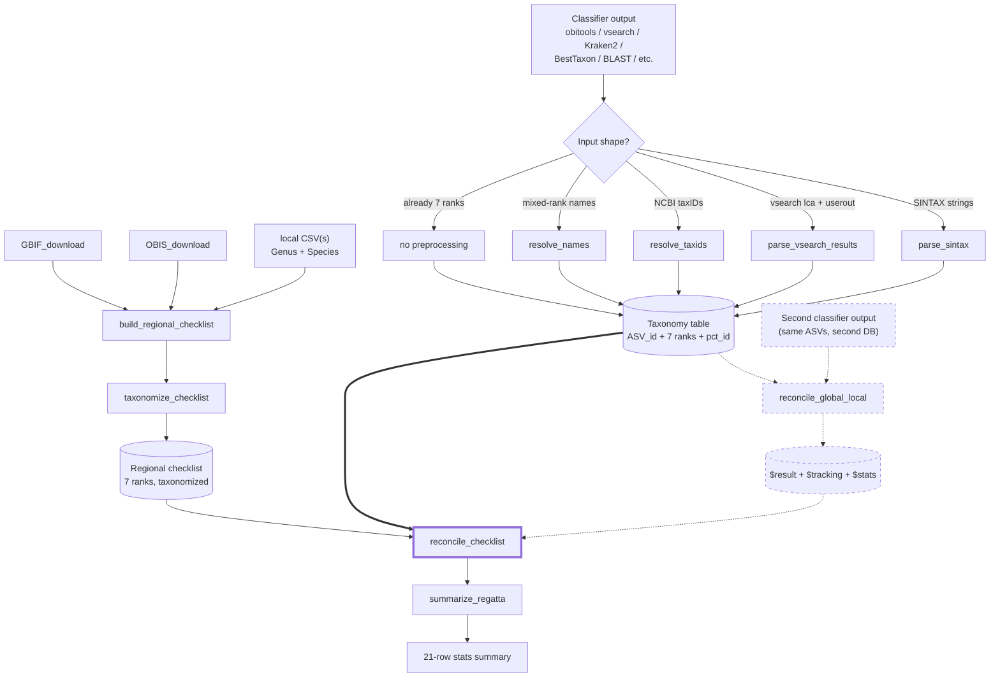

# REGATTA

<!-- badges: start -->
[](https://github.com/EWisely/REGATTA/actions/workflows/R-CMD-check.yaml)
<!-- badges: end -->

**Reconciling eDNA Geographic Assignments via Taxonomy Table Adjustment**

An R package for correcting off-target species assignments in eDNA
metabarcoding results using a regional species checklist — without manual
curation, and preserving as much taxonomic specificity as possible.

## The problem

Global reference databases (NCBI, EMBL, etc.) confidently assign eDNA reads
to species that don't actually live in your study area, because the closest
match in the database is a relative from somewhere else in the world. The
usual fixes — hand-curating a local reference database, or applying a flat
percent-identity cutoff — are either non-reproducible or sacrifice
specificity unnecessarily.

## The fix

REGATTA pulls a regional species list from public biodiversity sources
(GBIF, OBIS, plus any local CSVs you have), resolves it to NCBI taxonomy,
and uses it as a sanity filter on each ASV's classification. For each
assigned ASV, REGATTA finds the **lowest taxonomic rank shared between the
assignment and the regional checklist** and downgrades only that far.

A *Sebastes mystinus* call in a region that has *S. mystinus* on the
checklist stays at species. A call to *S. goodei* (a Pacific rockfish) in a
region whose checklist has other *Sebastes* but not *S. goodei* is
downgraded to genus *Sebastes* and flagged. A call to a tropical species in
a temperate-region checklist with no *Sebastes* at all gets walked up the
tree until something matches, or flagged as fully off-target if nothing
does.

Names on both sides — classifier output and checklist — are routed through a
**synonym-aware NCBI lookup**, so older nomenclature is updated to current
canonical taxonomy before the comparison (e.g. *Lagenorhynchus obliquidens*
→ *Sagmatias obliquidens*). A synonym on either side still matches in the
LCA walk, and each row records whether it resolved as a scientific name or
via a synonym.

## Installation

All dependencies are on CRAN and install automatically:

```r
# install.packages("devtools")
devtools::install_github("EWisely/REGATTA", build_vignettes = TRUE)
library(REGATTA)
```

Then read the worked examples:

```r
vignette("REGATTA-tutorial")       # single-classifier workflow
vignette("REGATTA-two-database")   # optional global-vs-local reconciliation
```

Building the vignettes needs `pandoc` (RStudio bundles it); from a plain R
session without pandoc, drop `build_vignettes = TRUE`. The checklist-building
steps additionally need a local NCBI taxonomy database built by `taxonomizr`
(see [Setup](#setup)); the core reconciliation functions and the runnable
vignette demos do not.

## Pipeline

The **core workflow** (solid arrows) runs one classifier output through
`reconcile_checklist()`. The **optional `reconcile_global_local()` branch**
(dashed) is a side-path you take only if you also have a second classifier
output for the same ASVs (e.g. one against a global DB and one against a
locally-curated DB); its `$result` slots in as a preprocessing step before
`reconcile_checklist()`.



## Quick-start — the one-call path

For most users the whole pipeline collapses to a single `run_regatta()`
call once you have a taxonomized regional checklist. It accepts file paths,
a vsearch `lca + userout` pair, a folder of inputs, or an explicit
`list(global =, local =)` for the two-DB workflow; file formats are
auto-detected and the right preprocessor is dispatched. It **returns** the
results; pass `out_dir` to also write the per-stage CSV triples, the 21-row
summary, and a `run_log.txt` recording what was detected and run.

```r
# Single-DB workflow (one classifier output, any tool)
run_regatta(
  input     = "data/MiFish_obi.tab",                              # obitools .tab
  checklist = "local_database_checklist/my_regional_checklist.rds"
)

# Single-DB with a vsearch lca + userout pair (LCA taxonomy + userout pct_id)
run_regatta(
  input     = c("data/vs_lca.txt", "data/vs_userout.txt"),
  checklist = "local_database_checklist/my_regional_checklist.rds"
)

# Two-DB workflow. Roles are declared explicitly via the named list,
# never inferred from filenames. Either side may be a vsearch lca+userout pair.
run_regatta(
  input = list(
    global = "data/obi.tab",
    local  = c("data/vs_lca.txt", "data/vs_userout.txt")
  ),
  checklist = "local_database_checklist/my_regional_checklist.rds"
)
```

For fine-grained control the lower-level `reconcile_global_local()`,
`reconcile_checklist()`, and `summarize_regatta()` functions remain
available; `run_regatta()` is a thin orchestrator on top of them.

## Setup

A few things to set up before building your own regional checklist.

**Output locations.** REGATTA functions **return** their results and write
nothing to disk by default — pass an `output_dir` (downloaders / build) or
`out_dir` (`run_regatta()`) to also save files in a directory you choose.
Local checklist CSVs (each with `Genus` and `Species` columns) can live
anywhere; pass their paths to `build_regional_checklist(CSV = ...)`, no
copying required.

**Credentials & taxonomy DB.** `GBIF_download()` uses your GBIF login; add
`GBIF_USER` / `GBIF_PWD` / `GBIF_EMAIL` to your `.Renviron`
(`usethis::edit_r_environ()`). `taxonomize_checklist()`, `resolve_names()`,
and `resolve_taxids()` need a local NCBI snapshot built by `taxonomizr`; the
first `taxonomize_checklist()` run builds `accessionTaxa.sql` (~15 min,
several GB) and reuses it after. Point each function at it via `sql_path`.

**Draw your polygon** at [wktmap.com](https://wktmap.com) and copy the WKT
`POLYGON ((long lat, long lat, ...))` string for the `regional_poly`
argument.

> **Tip:** check group names with `resolve_taxa()` before a long download —
> it disambiguates names against WoRMS by kingdom and flags GBIF backbone
> coverage. The shorthand `"fish"` expands to ray-finned fishes + sharks &
> rays + hagfishes + lampreys (the typical MiFish target), and `"vertebrates"`
> to `Vertebrata`. GBIF's backbone has no usable class node for bony fish, so
> `GBIF_download()` descends to order automatically — OBIS remains the more
> complete fish source, with GBIF as a supplement.

## Building the regional checklist (once per region × group)

```r
poly <- "POLYGON ((-117.4 32.0, -91.9 -6.3, -81.4 -6.3, -76.1 7.7, -82.1 8.6, -104.2 20.3, -112.5 32.2, -117.4 32.0))"

# One call: downloads OBIS (default on) and/or GBIF (default off), folds in
# any local CSV, and taxonomizes the LCA list. It RETURNS everything; assign
# it. (Add output_dir = "some/dir" to also write the files there.)
cl <- build_regional_checklist(
  region        = "galapagos",   # names the output files (if written)
  label         = "fish",        # short filename label (kept separate from taxa)
  taxa          = "fish",        # the query passed to the downloaders
  regional_poly = poly,
  OBIS          = TRUE,          # primary source (default)
  GBIF          = FALSE,         # off by default; TRUE = fresh download, or a key/object to reuse one
  CSV           = "~/other_project/Tirado-Sanchez_Galapagos_Pisces.csv",
  marine        = TRUE, terrestrial = FALSE,
  sql_path      = "/path/to/accessionTaxa.sql"
)
# cl$for_making_localdb  species-only list (-> a reference-DB builder like CRABS)
# cl$for_LCA             + retained genus-level entries
# cl$checklist           taxonomized, ready for run_regatta(checklist = cl$checklist)
```

## Per-taxonomic-group separation

Run the pipeline **once per taxonomic group** your primer targets — one pass
for fish (with a fish-only checklist), a separate pass for crustaceans, and
so on. Mixing groups into one megalist defeats the off-target check: a
MiFish primer that accidentally amplifies a crustacean would pass through a
fish+crustacean checklist instead of being flagged.

Nothing in the pipeline is fish-, marine-, or Galapagos-specific — the
examples use Galapagos fish only because that's what the package was
developed against. The only per-region work is building and taxonomizing the
checklist; every downstream function is taxonomy- and geography-agnostic,
and the function defaults carry no group label, so you can run multiple
groups side-by-side in one project without naming collisions.

## Functions

| Function | Purpose |
|---|---|
| `run_regatta()` | **High-level wrapper / recommended entry point.** Auto-detects classifier format, dispatches the right preprocessor, runs the reconcile steps, and writes the standard output triples + a 21-row summary + `run_log.txt`. |
| `resolve_taxa()` | Validate & disambiguate query taxon names against WoRMS (by kingdom); report GBIF backbone coverage. Run standalone to pre-check names. |
| `GBIF_download()` | Pull a GBIF species list inside a WKT polygon for given taxa. |
| `OBIS_download()` | Pull an OBIS species list, with optional marine/brackish/freshwater filters. |
| `build_regional_checklist()` | **Checklist-building entry point.** Runs OBIS (default) and/or GBIF (off by default; `TRUE` for a fresh download or a key/object to reuse one), folds in any local `Genus`+`Species` CSVs, and writes two lists named from `region`+`label`: a species-only `_for_making_localdb` list (for a reference-DB builder) and a `_for_LCA` list that also keeps genus-level entries. Then taxonomizes the LCA list in the background. |
| `taxonomize_checklist()` | Resolve a regional list to a 7-rank NCBI taxonomy table (synonym-aware). Runs **in the background** from `build_regional_checklist()`; `reconcile_checklist()`/`run_regatta()` also taxonomize on the fly (with a warning) if handed a raw checklist. Call directly only for inspection/caching. |
| `parse_sintax()` | Convert vsearch SINTAX taxonomy strings to 7 rank columns. |
| `parse_vsearch_results()` | Canonical vsearch preprocessor: join a vsearch `lca` (taxonomy) + `--userout` (pct_id) by ASV id. |
| `parse_vsearch_userout()` | Fallback parser when only a vsearch `--userout` file is available (best-hit taxonomy + pct_id). |
| `resolve_taxids()` | Convert NCBI taxIDs to 7 rank columns (e.g. obitools output). |
| `resolve_names()` | Convert mixed-rank scientific names (Kraken2 / BestTaxon style) to 7 rank columns; synonym-aware. |
| `reconcile_checklist()` | **Core LCA step.** Reconcile a taxonomy table against the regional checklist. Returns `$result` / `$tracking` / `$stats`. |
| `reconcile_global_local()` | Optional: reconcile two classifier outputs on the same ASVs (best percent-identity, falling back to the LCA of both when they disagree). Returns `$result` / `$tracking` / `$stats`. |
| `summarize_regatta()` | The 21-row per-stage stats summary comparing inputs to outputs. |

## Output

`reconcile_checklist()` and `reconcile_global_local()` each return a list of
three data frames and, unless `output_dir = NULL`, write them as three CSVs:

| Element | Contents |
|---|---|
| `$result` | The REGATTA exchange format — `ASV_id` + the 7 rank columns, with ranks rewritten by the reconciliation. |
| `$tracking` | Per-ASV before/after audit trail (and, after `reconcile_global_local()`, the global-vs-local decision columns). |
| `$stats` | Aggregate counts for that stage. |

`run_regatta()` writes one such triple per stage plus a top-level 21-row
`summarize_regatta()` summary and a `run_log.txt`, all under `out_dir`.

## Caveats

- **The regional checklist is only as good as its sources.** Names in your
  local CSVs that don't resolve in NCBI become inert (they can never match
  classifier output, which is also NCBI-canonical) — but they don't degrade
  correctness.
- **Two reconciliation jobs are distinct.** `reconcile_checklist()`
  validates an assignment against the *region*. `reconcile_global_local()`
  reconciles *two classifier runs* against each other. Use the latter only
  when you have a second classifier output for the same ASVs.
- **Rank set is fixed at 7 levels:** `domain`, `phylum`, `class`, `order`,
  `family`, `genus`, `species`. Subspecies and superkingdom are not used.

## Status

In development, heading toward a CRAN release and a companion methods paper.
Function names and signatures are stabilizing but may still change before
the first stable release.

## Authors

Eldridge Wisely (Scripps Institution of Oceanography, UC San Diego),
developer and maintainer, with contributions from Ella Crotty (OBIS and GBIF generalizations and summary output format).

## License

MIT (see `LICENSE`).
