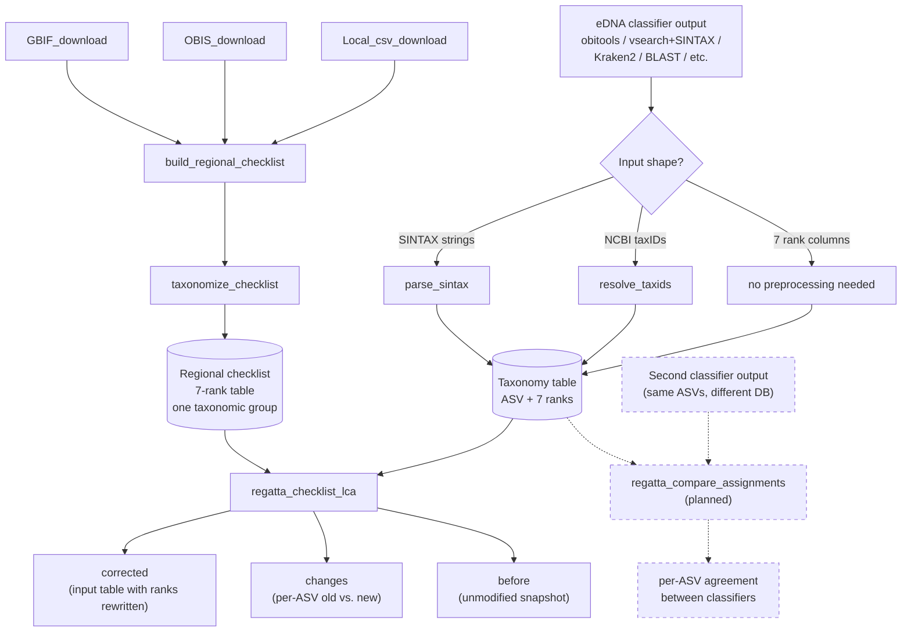

# REGATTA

**Reproducible Eco-Geographic Assignment Through Taxonomic Adjustment**

An R package (in development) for correcting off-target species assignments in
eDNA metabarcoding results using a regional species checklist, without manual
curation and while preserving as much taxonomic specificity as possible.

## The problem

Global reference databases (NCBI, EMBL, etc.) confidently assign eDNA reads
to species that don't actually live in your study area, because the closest
match in the database is a relative from somewhere else in the world. The
usual fixes — hand-curating a local reference database, or applying a flat
percent-identity cutoff — are either non-reproducible or sacrifice
specificity unnecessarily.

## The fix

REGATTA pulls a regional species list from public biodiversity sources
(GBIF, OBIS, plus any local CSVs you have), resolves it to NCBI taxonomy,
and uses it as a sanity filter on each ASV's classification. For each
assigned ASV, REGATTA finds the **lowest taxonomic rank shared between
the assignment and the regional checklist** and downgrades only that far.

A *Sebastes mystinus* call in a region that has *S. mystinus* on the
checklist stays at species. A call to *S. goodei* (a Pacific rockfish) in
a region whose checklist has other *Sebastes* but not *S. goodei* is
downgraded to genus *Sebastes* and flagged. A call to a tropical species
in a temperate-region checklist with no *Sebastes* at all gets walked up
the tree until something matches, or flagged as fully off-target if
nothing does.

## Pipeline



## Per-taxonomic-group separation

Run the pipeline **once per taxonomic group** that your primer targets —
one full pass for fish (with a fish-only checklist), a separate pass for
crustaceans (with a crustacean-only checklist), and so on. Mixing groups
into one megalist defeats the off-target check: a MiFish primer that
accidentally amplifies a crustacean would pass through a fish+crustacean
checklist instead of being flagged.

## Functions

| Function | Purpose | External dependencies |
|---|---|---|
| `GBIF_download()` | Pull a GBIF species list inside a WKT polygon for given high-level taxa | `rgbif`, `worrms`, `taxize` |
| `OBIS_download()` | Pull an OBIS species list with optional marine/brackish/freshwater filters | `robis` |
| `Local_csv_download()` | Read user-supplied checklist CSVs (Genus, Species columns) | none |
| `build_regional_checklist()` | Merge the three source outputs into one deduplicated regional list (currently named `dataset_combine`; rename pending) | none |
| `taxonomize_checklist()` | Resolve a regional list to a 7-rank NCBI taxonomy table | `taxonomizr` |
| `parse_sintax()` | Convert vsearch SINTAX taxonomy strings to 7 rank columns | none |
| `resolve_taxids()` | Convert NCBI taxIDs to 7 rank columns (e.g. obitools output) | `taxonomizr` |
| `regatta_checklist_lca()` | The core LCA step. Reconcile a taxonomy table against the regional checklist | none (base R) |
| `regatta_compare_assignments()` *(planned)* | Optional comparison of two classifier outputs on the same ASVs | TBD |

## Quick-start

The package is currently a collection of R scripts in this repository; it
is not yet installable via `install.packages()`. Source the functions
directly:

```r
source("GBIF_download.R")
source("OBIS_download.R")
source("Local_csv_download.R")
source("Dataset_combine.R")          # to be renamed build_regional_checklist
source("taxonomize_checklist.R")
source("parse_sintax.R")
source("resolve_taxids.R")
source("regatta_checklist_lca.R")
```

### 1. Build a regional species list (one taxonomic group)

```r
poly <- "POLYGON ((-117.421875 31.952162, -91.933594 -6.315299, -81.386719 -6.315299, -76.113281 7.710992, -82.089844 8.581021, -87.011719 13.581921, -104.238281 20.303418, -112.5 32.249974, -117.421875 31.952162))"  # E. Tropical Pacific incl. Galapagos
GBIF_download(obis_taxa = "Osteichthyes",
              worms_taxa = "Actinopterygii",
              regional_poly = poly,
              gbif_outputname = "GBIF_galapagos_fish")
OBIS_download(obis_taxa = "Osteichthyes",
              regional_poly = poly,
              obis_outputname = "OBIS_galapagos_fish",
              marine = TRUE, terrestrial = FALSE)
Local_csv_download(loc_csvs = "2016Aug24_Tirado-Sanchez_et_al_Galapagos_Pisces_Checklist.csv",
                   loc_outputname = "Local_galapagos_fish")
dataset_combine(comb_inputnames = c("GBIF_galapagos_fish",
                                    "OBIS_galapagos_fish",
                                    "Local_galapagos_fish"),
                comb_outputname = "comprehensive_galapagos_fish_list")
```

### 2. Taxonomize the checklist (once per region per group)

```r
fish_checklist <- taxonomize_checklist(
  input    = "custom_db/comprehensive_galapagos_fish_list.txt",
  sql_path = "/path/to/accessionTaxa.sql"
)
saveRDS(fish_checklist, "custom_db/comprehensive_galapagos_fish_list_taxonomized.rds")
```

`taxonomize_checklist()` builds the `accessionTaxa.sql` database the first
time you run it (~15 minutes, several GB downloaded) and reuses it on
subsequent calls.

### 3. Convert your classifier output to a 7-rank taxonomy table

For vsearch with SINTAX-format output:

```r
vs <- readr::read_delim("lca_results.txt", col_names = c("ASV_id", "sintax"), delim = "\t")
taxonomy_table <- cbind(ASV_id = vs$ASV_id, parse_sintax(vs$sintax))
```

For obitools (NCBI taxID column):

```r
obi <- readr::read_delim("MiFish_Menu_95_named.tab", delim = "\t")
ranks <- resolve_taxids(obi$TAXID, sql_path = "/path/to/accessionTaxa.sql")
taxonomy_table <- cbind(
  ASV_id = obi$ID,
  pct_id = obi$BEST_IDENTITY * 100,
  count  = obi$COUNT,
  ranks
)
```

For any other classifier, supply a data.frame with an ASV ID column plus
the 7 ranks `domain`, `phylum`, `class`, `order`, `family`, `genus`,
`species` (NA where unresolved). No preprocessing needed.

### 4. Run the LCA reconciliation

```r
result <- regatta_checklist_lca(taxonomy_table, fish_checklist, id_col = "ASV_id")

result$before     # snapshot of the input
result$corrected  # input with ranks rewritten + a regatta_match_rank column
result$changes    # one row per ASV that was modified, with old vs. new at each rank
```

## Output

`regatta_checklist_lca()` returns a list of three data frames so you can
keep a permanent before/after audit trail and a per-ASV change log without
recomputing anything.

| Element | Contents |
|---|---|
| `before` | Faithful copy of the input taxonomy table |
| `corrected` | Input table with rank columns rewritten and a `regatta_match_rank` column added (one of `species`, `genus`, `family`, `order`, `class`, `phylum`, `domain`, or NA for fully off-target ASVs). All non-rank columns (`pct_id`, `count`, `sequence`, etc.) preserved untouched |
| `changes` | One row per ASV whose taxonomy changed, with `before_*` / `after_*` columns at each rank and the matched rank |

Both per-ASV change logs and aggregate stats summaries are derivable from
`changes` — REGATTA leaves report formatting to you (or to thin reporting
helpers shipped separately).

## Accepted input shapes

The taxonomy table you feed to `regatta_checklist_lca()` must be uniform
in shape — all rows in one of the four forms below. Mixed shapes within
one call are not supported.

| Shape | Required columns | Preprocessor |
|---|---|---|
| 1. Pre-resolved ranks | `ASV_id` + 7 rank columns | none |
| 2. NCBI taxIDs | `ASV_id` + `taxID` | `resolve_taxids()` |
| 3. NCBI accessions | `ASV_id` + `accession` | (planned) |
| 4. Scientific names | `ASV_id` + `scientific_name` | (planned, fuzziest) |

## Caveats

- **The regional checklist is only as good as its sources.** Outdated or
  misspelled names in your local CSVs that don't resolve in NCBI become
  inert entries (they can never match anything in classifier output, since
  classifier output is also NCBI-canonical) — but they don't degrade
  correctness.
- **REGATTA does not reconcile classifier disagreements between databases.**
  If obitools and vsearch disagree at species level (e.g. *Mugil curema*
  vs. *Mugil thoburni*), REGATTA validates each independently against the
  regional checklist. Reconciling between two classifier runs is the job
  of `regatta_compare_assignments()` *(planned)*.
- **Rank set is fixed at 7 levels:** `domain`, `phylum`, `class`, `order`,
  `family`, `genus`, `species`. Subspecies and superkingdom are not used.

## Status

This repository is the development sandbox for what will become a CRAN
package and a companion methods paper. Function names and signatures
may still change before the first stable release.

## Authors

Eldridge Wisely (Scripps Institution of Oceanography, UC San Diego)
with contributions from Ella Crotty.

## License

MIT.
