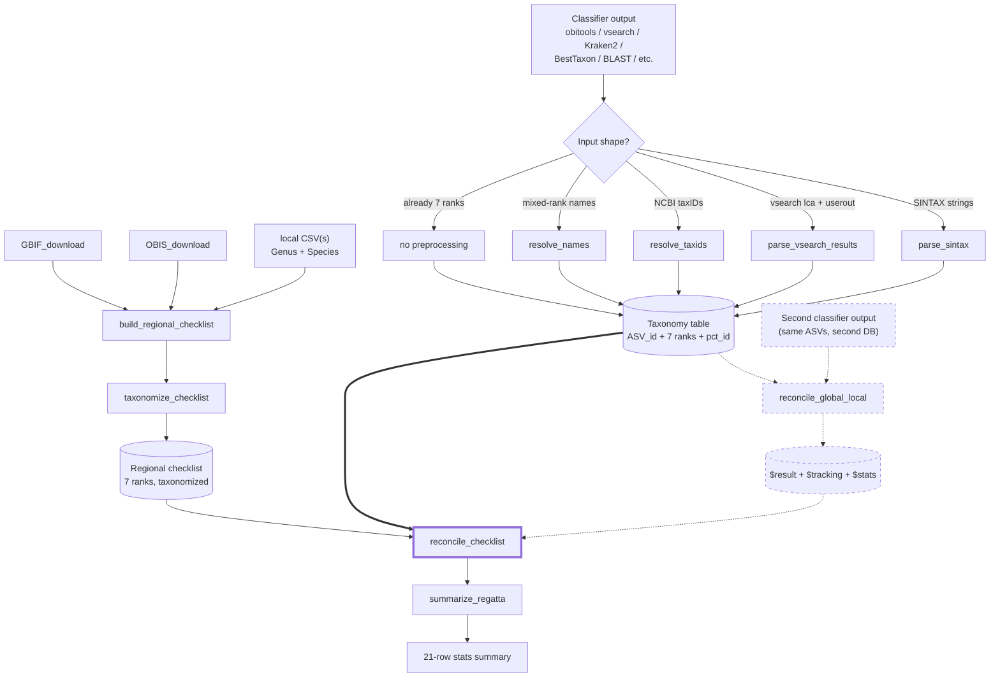

# REGATTA

<!-- badges: start -->
[](https://github.com/EWisely/REGATTA/actions/workflows/R-CMD-check.yaml)
<!-- badges: end -->

**Reconciling eDNA Geographic Assignments via Taxonomy Table Adjustment**

An R package for reconciling eDNA metabarcoding taxonomic assignments against
a regional species checklist — downgrading the taxonomic specificity of
species-level calls to taxa with no records in the study area, rather than
discarding them — without manual curation, and preserving as much taxonomic
specificity as the regional evidence supports.

## The problem

Global reference databases (NCBI, EMBL, etc.) confidently assign eDNA reads
to species that don't actually live in your study area — within the group
your primer targets (e.g. a freshwater fish called from marine fish-primer
data). This is **not** off-target amplification: the read is still a fish, but
the species-level *name* is geographically implausible. It typically happens
because the true local species is absent from the database, so the read
matches its nearest sequenced relative at the amplified region; lab
contamination or degraded input DNA can contribute too. The usual fixes —
hand-curating a local reference database, or applying a flat percent-identity
cutoff — are either non-reproducible or sacrifice specificity unnecessarily.

## The fix

REGATTA pulls a regional species list from public biodiversity sources
(GBIF, OBIS, plus any local CSVs you have), resolves it to NCBI taxonomy,
and uses it as a sanity filter on each ASV's classification. For each
assigned ASV, REGATTA finds the **lowest taxonomic rank shared between the
assignment and the regional checklist** and downgrades only that far.

A *Sebastes mystinus* call in a region that has *S. mystinus* on the
checklist stays at species. A call to *S. goodei* (a Pacific rockfish) in a
region whose checklist has other *Sebastes* but not *S. goodei* is
downgraded to genus *Sebastes* and flagged. A call to a tropical species in
a temperate-region checklist with no *Sebastes* at all gets walked up the
tree until something matches, or flagged as having no regional record if
nothing does.

Names on both sides — classifier output and checklist — are routed through a
**synonym-aware NCBI lookup**, so older nomenclature is updated to current
canonical taxonomy before the comparison (e.g. *Lagenorhynchus obliquidens*
→ *Sagmatias obliquidens*). A synonym on either side still matches in the
LCA walk, and each row records whether it resolved as a scientific name or
via a synonym.

## Installation

All dependencies are on CRAN and install automatically:

```r
# install.packages("devtools")
devtools::install_github("EWisely/REGATTA", build_vignettes = TRUE)
library(REGATTA)
```

Then read the worked examples:

```r
vignette("REGATTA-tutorial")       # single-classifier workflow
vignette("REGATTA-two-database")   # optional global-vs-local reconciliation
```

Building the vignettes needs `pandoc` (RStudio bundles it); from a plain R
session without pandoc, drop `build_vignettes = TRUE`. The checklist-building
steps additionally need a local NCBI taxonomy database built by `taxonomizr`
(see [Setup](#setup)); the core reconciliation functions and the runnable
vignette demos do not.

## Pipeline

The **core workflow** (solid arrows) runs one classifier output through
`reconcile_checklist()`. The **optional `reconcile_global_local()` branch**
(dashed) is a side-path you take only if you also have a second classifier
output for the same ASVs (e.g. one against a global DB and one against a
locally-curated DB); its `$result` slots in as a preprocessing step before
`reconcile_checklist()`.



## Quick-start — the one-call path

For most users the whole pipeline collapses to a single `run_regatta()`
call once you have a taxonomized regional checklist. It accepts file paths,
a vsearch `lca + userout` pair, a folder of inputs, or an explicit
`list(global =, local =)` for the two-DB workflow; file formats are
auto-detected and the right preprocessor is dispatched. It **returns** the
results and also writes them: `out_dir` is **required**, and each run lands in
its own dated `<region>_<label>_<Date>` subfolder of it (the per-stage CSV
triples, the 21-row summary, and a `run_log.txt` recording what was detected
and run). Pass the same `region`/`label` you gave `build_regional_checklist()`.

```r
# Single-DB workflow (one classifier output, any tool)
run_regatta(
  input     = "data/MiFish_obi.tab",                              # obitools .tab
  checklist = "local_database_checklist/my_regional_checklist.rds",
  out_dir   = "regatta_out", region = "galapagos", label = "fish"
)

# Single-DB with a vsearch lca + userout pair (LCA taxonomy + userout pct_id)
run_regatta(
  input     = c("data/vs_lca.txt", "data/vs_userout.txt"),
  checklist = "local_database_checklist/my_regional_checklist.rds",
  out_dir   = "regatta_out", region = "galapagos", label = "fish"
)

# Two-DB workflow. Roles are declared explicitly via the named list,
# never inferred from filenames. Either side may be a vsearch lca+userout pair.
run_regatta(
  input = list(
    global = "data/obi.tab",
    local  = c("data/vs_lca.txt", "data/vs_userout.txt")
  ),
  checklist = "local_database_checklist/my_regional_checklist.rds",
  out_dir   = "regatta_out", region = "galapagos", label = "fish"
)
```

For fine-grained control the lower-level `reconcile_global_local()`,
`reconcile_checklist()`, and `summarize_regatta()` functions remain
available; `run_regatta()` is a thin orchestrator on top of them.

## Setup

A few things to set up before building your own regional checklist.

**Output locations.** The two entry points — `build_regional_checklist()`
(`output_dir`) and `run_regatta()` (`out_dir`) — **require** an output
directory and write each run into its own dated `<region>_<label>_<Date>`
subfolder of it, so successive runs don't pile up. The results are also
returned. The lower-level building blocks (`reconcile_checklist()`,
`reconcile_global_local()`, `OBIS_download()`, `GBIF_download()`, `resolve_*()`)
keep their output dir **optional** (default: return only, write nothing) so they
compose cleanly. Local checklist CSVs (each with `Genus` and `Species` columns)
can live anywhere; pass their paths to `build_regional_checklist(CSV = ...)`, no
copying required.

**GBIF credentials.** `GBIF_download()` (and `build_regional_checklist(GBIF = TRUE)`)
needs a free [GBIF account](https://www.gbif.org/user/profile) and authenticates
with your account credentials — there is no separate "API key". Add
`GBIF_USER` / `GBIF_PWD` / `GBIF_EMAIL` to your `.Renviron`
(`usethis::edit_r_environ()`, then restart R). A fresh GBIF download is an
asynchronous `occ_download` that **takes several minutes** while GBIF assembles
it server-side.

**Taxonomy database.** Taxonomizing needs a local NCBI snapshot built by
`taxonomizr`. `build_regional_checklist()`, `run_regatta()`, and
`reconcile_checklist()` default `sql_path` to a **persistent per-user cache**
(`tools::R_user_dir("REGATTA","cache")`), shared across projects/sessions, and
build only the lightweight names+nodes (~a few hundred MB, a few minutes — not
the multi-GB accession data) on first use. **Override** it by pointing
`sql_path` at an existing DB you already have. When a needed DB is missing they
prompt to build it (interactively) or, in a script, error with the one-line
build command unless `overwrite_taxonomy_files = TRUE`. The cache is a
**snapshot** of NCBI taxonomy and is never rebuilt silently (for
reproducibility) — its build date is reported and recorded in `cl$methods`;
`overwrite_taxonomy_files = TRUE` refreshes it in place. (Set `sql_path = NULL`
in `build_regional_checklist()` to skip taxonomizing there and defer it to
`run_regatta()`. Accession-based input to `run_regatta()` is the only path that
needs the full `taxonomizr::prepareDatabase()` build with `accession2taxid`.)

**Draw your polygon** at [wktmap.com](https://wktmap.com) and copy the WKT
`POLYGON ((long lat, long lat, ...))` string for the `regional_poly`
argument.

> **Tip:** check group names with `resolve_taxa()` before a long download —
> it disambiguates names against WoRMS by kingdom and flags GBIF backbone
> coverage. The shorthand `"fish"` expands to ray-finned fishes + sharks &
> rays + hagfishes + lampreys (the typical MiFish target), and `"vertebrates"`
> to those plus mammals, birds, reptiles, and amphibians (all the vertebrate
> classes, so it works in both OBIS and GBIF). GBIF's backbone has no usable
> class node for bony fish, so
> `GBIF_download()` descends to order automatically — OBIS remains the more
> complete fish source, with GBIF as a supplement.

## Building the regional checklist (once per region × group)

```r
poly <- "POLYGON ((-117.4 32.0, -91.9 -6.3, -81.4 -6.3, -76.1 7.7, -82.1 8.6, -104.2 20.3, -112.5 32.2, -117.4 32.0))"

# Where the taxonomy cache lives (built once on first use, reused across
# projects) -- run this to see the path; pass your own path to sql_path to
# override it:
tools::R_user_dir("REGATTA", "cache")

# One call: downloads OBIS (default on) and/or GBIF (default off), folds in
# any local CSV, and taxonomizes the LCA list. It RETURNS everything AND writes
# it to the required output_dir.
cl <- build_regional_checklist(
  region        = "galapagos",   # names the output files
  label         = "fish",        # short filename label (kept separate from taxa)
  taxa          = "fish",        # the query passed to the downloaders
  regional_poly = poly,
  OBIS          = TRUE,          # primary source (default)
  GBIF          = FALSE,         # off by default; TRUE = fresh download, or a key/object to reuse one
  CSV           = NULL,          # optional: path(s) to YOUR local checklist CSV(s),
                                 # ideally a citable published list (for reproducibility)
  marine        = TRUE, terrestrial = FALSE,
  output_dir    = "local_database_checklist",  # REQUIRED: outputs go in a dated
                                    # <region>_<label>_<date> subfolder here
  sql_path      = file.path(tools::R_user_dir("REGATTA", "cache"), "accessionTaxa.sql")
  # ^ this IS the default (a persistent cache, built on first use). Replace it
  #   with "/path/to/your/accessionTaxa.sql" to reuse an existing DB.
  #   overwrite_taxonomy_files = TRUE refreshes a stale one; sql_path = NULL skips it.
)
# cl$for_making_localdb     bare vector of unique species names; write one-per-line
#                           for a reference-DB builder like CRABS:
#                           writeLines(cl$for_making_localdb, "fish_for_crabs.txt")
# cl$checklist_summary      full taxonomized table with per-name resolution status (audit)
# cl$for_LCA                taxID + the 7 ranks, ready for run_regatta(checklist = cl$for_LCA)
# cl$methods                methods/provenance sentence with live citations,
#                           incl. any GBIF download key + DOI + citation (verify them)
```

> **GBIF (`GBIF = TRUE`) takes several minutes** — it submits an `occ_download`
> job and waits for GBIF to build it. GBIF needs a free account and authenticates
> with your account **credentials** (no separate "API key"): register at
> [gbif.org](https://www.gbif.org/user/profile), then add `GBIF_USER`, `GBIF_PWD`,
> and `GBIF_EMAIL` to your `~/.Renviron` (`usethis::edit_r_environ()`, then restart
> R). Reuse a finished download by passing its key/object to `GBIF =`.
>
> Whenever GBIF is used (a fresh download **or** a reused key), its download
> **key + DOI + citation** are folded into `cl$methods` — the DOI is fetched
> from the key via `rgbif::occ_download_meta()`, so it's recorded for reused
> downloads too. `cl$methods` is the single provenance home; always verify the
> citations against your reference manager.

## Per-taxonomic-group separation

Run the pipeline **once per taxonomic group** your primer targets — one pass
for fish (with a fish-only checklist), a separate pass for crustaceans, and
so on. This also keeps genuine *off-target amplifications* visible — a
non-target group (e.g. a crustacean picked up by a fish-targeting MiFish
primer). Mixing groups into one megalist hides them: that crustacean would
pass through a fish+crustacean checklist instead of standing out against a
fish-only one.

Nothing in the pipeline is fish-, marine-, or Galapagos-specific — the
examples use Galapagos fish only because that's what the package was
developed against. The only per-region work is building and taxonomizing the
checklist; every downstream function is taxonomy- and geography-agnostic,
and the function defaults carry no group label, so you can run multiple
groups side-by-side in one project without naming collisions.

## Functions

| Function | Purpose |
|---|---|
| `run_regatta()` | **High-level wrapper / recommended entry point.** Auto-detects classifier format, dispatches the right preprocessor, runs the reconcile steps, and **returns** the reconciled tables + a 21-row summary. **`out_dir` is required**; the output triples + summary + `run_log.txt` are written into a dated `<region>_<label>_<Date>` subfolder of it (pass `region`/`label` to name it). |
| `resolve_taxa()` | Validate & disambiguate query taxon names against WoRMS (by kingdom); report GBIF backbone coverage. Run standalone to pre-check names. |
| `GBIF_download()` | Pull a GBIF species list inside a WKT polygon for given taxa. |
| `OBIS_download()` | Pull an OBIS species list, with optional marine/brackish/freshwater filters. |
| `build_regional_checklist()` | **Checklist-building entry point.** Runs OBIS (default) and/or GBIF (off by default; `TRUE` for a fresh download or a key/object to reuse one), folds in any local `Genus`+`Species` CSVs (optional, default `NULL`; prefer a citable list), optionally taxonomizes the LCA list, and **returns** `for_making_localdb` (a bare vector of unique species names, for a reference-DB builder), `checklist_summary` (the full taxonomized table with per-name resolution status), and `for_LCA` (`taxID` + the 7 ranks, ready for the LCA step), plus `methods` (the provenance sentence, which also carries any GBIF download key/DOI/citation). **`output_dir` is required** — outputs go in a dated `<region>_<label>_<date>` subfolder. `sql_path` defaults to a persistent per-user cache (built on first use, overridable with an existing DB path); `sql_path = NULL` skips taxonomizing here. A fresh `GBIF = TRUE` download takes several minutes and needs GBIF account credentials in `~/.Renviron`. |
| `taxonomize_checklist()` | Resolve a regional list to a 7-rank NCBI taxonomy table (synonym-aware). Runs **in the background** from `build_regional_checklist()`; `reconcile_checklist()`/`run_regatta()` also taxonomize on the fly (with a warning) if handed a raw checklist. Call directly only for inspection/caching. |
| `parse_sintax()` | Convert vsearch SINTAX taxonomy strings to 7 rank columns. |
| `parse_vsearch_results()` | Canonical vsearch preprocessor: join a vsearch `lca` (taxonomy) + `--userout` (pct_id) by ASV id. |
| `parse_vsearch_userout()` | Fallback parser when only a vsearch `--userout` file is available (best-hit taxonomy + pct_id). |
| `resolve_taxids()` | Convert NCBI taxIDs to 7 rank columns (e.g. obitools output). |
| `resolve_names()` | Convert mixed-rank scientific names (Kraken2 / BestTaxon style) to 7 rank columns; synonym-aware. |
| `reconcile_checklist()` | **Core LCA step.** Reconcile a taxonomy table against the regional checklist. Returns `$result` / `$tracking` / `$stats`. |
| `reconcile_global_local()` | Optional: reconcile two classifier outputs on the same ASVs (best percent-identity, falling back to the LCA of both when they disagree). Returns `$result` / `$tracking` / `$stats`. |
| `summarize_regatta()` | The 21-row per-stage stats summary comparing inputs to outputs. |

## Output

`reconcile_checklist()` and `reconcile_global_local()` each return a list of
three data frames, and write them as three CSVs only when given an `output_dir`:

| Element | Contents |
|---|---|
| `$result` | The REGATTA exchange format — `ASV_id` + the 7 rank columns, with ranks rewritten by the reconciliation. |
| `$tracking` | Per-ASV before/after audit trail (and, after `reconcile_global_local()`, the global-vs-local decision columns). |
| `$stats` | Aggregate counts for that stage. |

`run_regatta()` returns these and writes one such triple per stage — plus a
top-level 21-row `summarize_regatta()` summary and a `run_log.txt` — into the
dated run subfolder of `out_dir`.

## Caveats

- **The regional checklist is only as good as its sources.** Names in your
  local CSVs that don't resolve in NCBI become inert (they can never match
  classifier output, which is also NCBI-canonical) — but they don't degrade
  correctness.
- **Two reconciliation jobs are distinct.** `reconcile_checklist()`
  validates an assignment against the *region*. `reconcile_global_local()`
  reconciles *two classifier runs* against each other. Use the latter only
  when you have a second classifier output for the same ASVs.
- **Rank set is fixed at 7 levels:** `domain`, `phylum`, `class`, `order`,
  `family`, `genus`, `species`. Subspecies and superkingdom are not used.

## Status

In development, heading toward a CRAN release and a companion methods paper.
Function names and signatures are stabilizing but may still change before
the first stable release.

## Authors

Eldridge Wisely (Scripps Institution of Oceanography, UC San Diego),
developer and maintainer, with contributions from Ella Crotty (OBIS and GBIF generalizations and summary output format).

## License

MIT (see `LICENSE`).
