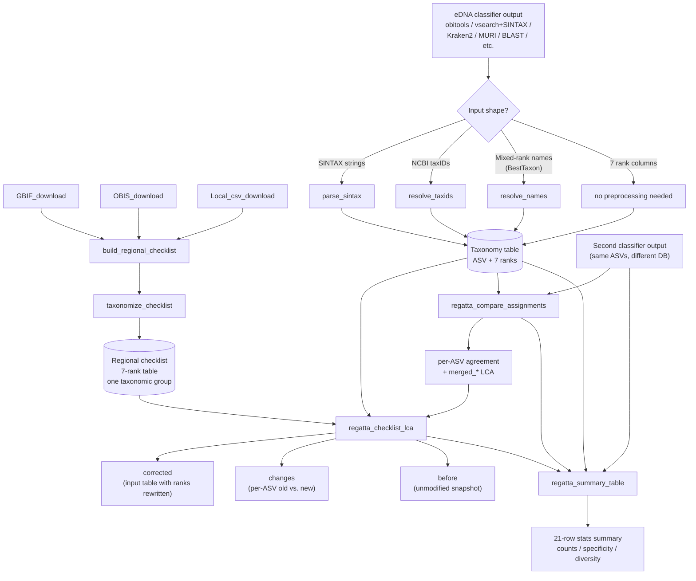

# REGATTA

**Reproducible Eco-Geographic Assignment Through Taxonomic Adjustment**

An R package (in development) for correcting off-target species assignments in
eDNA metabarcoding results using a regional species checklist, without manual
curation and while preserving as much taxonomic specificity as possible.

## The problem

Global reference databases (NCBI, EMBL, etc.) confidently assign eDNA reads
to species that don't actually live in your study area, because the closest
match in the database is a relative from somewhere else in the world. The
usual fixes — hand-curating a local reference database, or applying a flat
percent-identity cutoff — are either non-reproducible or sacrifice
specificity unnecessarily.

## The fix

REGATTA pulls a regional species list from public biodiversity sources
(GBIF, OBIS, plus any local CSVs you have), resolves it to NCBI taxonomy,
and uses it as a sanity filter on each ASV's classification. For each
assigned ASV, REGATTA finds the **lowest taxonomic rank shared between
the assignment and the regional checklist** and downgrades only that far.

A *Sebastes mystinus* call in a region that has *S. mystinus* on the
checklist stays at species. A call to *S. goodei* (a Pacific rockfish) in
a region whose checklist has other *Sebastes* but not *S. goodei* is
downgraded to genus *Sebastes* and flagged. A call to a tropical species
in a temperate-region checklist with no *Sebastes* at all gets walked up
the tree until something matches, or flagged as fully off-target if
nothing does.

### Method advantages

- **Synonym-aware name lookup.** Classifier outputs and regional
  checklists are routed through a synonym-aware NCBI lookup. Names that
  reflect older nomenclature get **automatically updated to the current
  canonical taxonomy** during preprocessing — e.g. *Lagenorhynchus
  obliquidens* → *Sagmatias obliquidens* (recent cetacean revision),
  *Antennarius sanguineus* → *Abantennarius sanguineus* (frogfish genus
  split), *Caranx ruber* → *Carangoides ruber* (jack revision). This
  normalizes both the classifier output and the regional checklist to
  the same canonical names, so a synonym on either side still matches
  in the LCA walk. Each row's `name_match_type` column flags whether
  the name resolved as a canonical scientific name or via a synonym,
  so the downstream summary report can distinguish "this name was
  updated to current taxonomy" from a checklist-based downgrade.
- **No manual curation.** The whole pipeline is deterministic and
  scriptable. Given the same inputs (source CSVs, regional polygon,
  NCBI taxonomy snapshot), the same outputs come back.
- **Specificity-preserving.** Downgrades only happen when the
  checklist forces them. No flat percent-identity cutoffs that throw
  away species-level information unnecessarily.

## Pipeline



## Per-taxonomic-group separation

Run the pipeline **once per taxonomic group** that your primer targets —
one full pass for fish (with a fish-only checklist), a separate pass for
crustaceans (with a crustacean-only checklist), and so on. Mixing groups
into one megalist defeats the off-target check: a MiFish primer that
accidentally amplifies a crustacean would pass through a fish+crustacean
checklist instead of being flagged.

## Functions

| Function | Purpose | External dependencies |
|---|---|---|
| `GBIF_download()` | Pull a GBIF species list inside a WKT polygon for given high-level taxa | `rgbif`, `worrms`, `taxize` |
| `OBIS_download()` | Pull an OBIS species list with optional marine/brackish/freshwater filters | `robis` |
| `Local_csv_download()` | Read user-supplied checklist CSVs (Genus, Species columns) | none |
| `build_regional_checklist()` | Merge the three source outputs into one deduplicated regional list (currently named `dataset_combine`; rename pending) | none |
| `parse_sintax()` | Convert vsearch SINTAX taxonomy strings to a full 7-rank taxonomy table | none |
| `resolve_taxids()` | Convert NCBI taxIDs to a full 7-rank taxonomy table (e.g. obitools output) | `taxonomizr` |
| `resolve_names()` | Convert mixed-rank scientific names (Kraken2 / BestTaxon style) to a full 7-rank taxonomy table; strips sp./spp./cf./aff./Gen./indet./quotes before lookup; synonym-aware (matches NCBI scientific names + recorded synonyms, excludes common names) | `taxonomizr`, `RSQLite` |
| `taxonomize_checklist()` | Resolve a regional species list to a 7-rank NCBI taxonomy table; synonym-aware lookup | `taxonomizr`, `RSQLite` |
| `name_to_taxid()` *(internal)* | Synonym-aware name → NCBI taxID lookup used by the two functions above. Accepted name types are configurable via `accept_types` | `RSQLite` |
| `regatta_checklist_lca()` | The core LCA step. Reconcile a taxonomy table against the regional checklist | none (base R) |
| `regatta_compare_assignments()` | Optional comparison of two classifier outputs on the same ASVs. Per-ASV side-by-side with `agreement_rank`, `agreement_category` (`agree_at_<rank>` / `disagree` / `only_<label>` / `both_unassigned`), and `merged_*` LCA columns feedable into `regatta_checklist_lca()` | none (base R) |
| `regatta_summary_table()` | The 21-row per-rank stats summary (counts, % assigned, ID'ed-to-rank specificity, diversity counts) across any number of named stages. Source-breakdown rows populate when a `regatta_compare_assignments()` result and DB labels are also supplied. Format designed by Ella Crotty | none (base R) |

## Quick-start

The package is currently a collection of R scripts in this repository; it
is not yet installable via `install.packages()`. Source the functions
directly:

```r
source("GBIF_download.R")
source("OBIS_download.R")
source("Local_csv_download.R")
source("Build_regional_checklist.R")
source("taxonomize_checklist.R")
source("parse_sintax.R")
source("resolve_taxids.R")
source("resolve_names.R")
source("regatta_checklist_lca.R")
source("regatta_compare_assignments.R")
source("regatta_summary_table.R")
```

### 1. Build a regional species list (one taxonomic group)

```r
poly <- "POLYGON ((-117.421875 31.952162, -91.933594 -6.315299, -81.386719 -6.315299, -76.113281 7.710992, -82.089844 8.581021, -87.011719 13.581921, -104.238281 20.303418, -112.5 32.249974, -117.421875 31.952162))"  # E. Tropical Pacific incl. Galapagos
GBIF_download(obis_taxa = "Osteichthyes",
              worms_taxa = "Actinopterygii",
              regional_poly = poly,
              gbif_outputname = "GBIF_galapagos_fish")
OBIS_download(obis_taxa = "Osteichthyes",
              regional_poly = poly,
              obis_outputname = "OBIS_galapagos_fish",
              marine = TRUE, terrestrial = FALSE)
Local_csv_download(loc_csvs = "2016Aug24_Tirado-Sanchez_et_al_Galapagos_Pisces_Checklist.csv",
                   loc_outputname = "Local_galapagos_fish")
dataset_combine(comb_inputnames = c("GBIF_galapagos_fish",
                                    "OBIS_galapagos_fish",
                                    "Local_galapagos_fish"),
                comb_outputname = "comprehensive_galapagos_fish_list")
```

### 2. Taxonomize the checklist (once per region per group)

```r
fish_checklist <- taxonomize_checklist(
  input    = "custom_db/comprehensive_galapagos_fish_list.txt",
  sql_path = "/path/to/accessionTaxa.sql"
)
saveRDS(fish_checklist, "custom_db/comprehensive_galapagos_fish_list_taxonomized.rds")
```

`taxonomize_checklist()` builds the `accessionTaxa.sql` database the first
time you run it (~15 minutes, several GB downloaded) and reuses it on
subsequent calls.

### 3. Convert your classifier output to a 7-rank taxonomy table

Each preprocessor takes your classifier's table and adds the 7 rank
columns, preserving all your other columns (sample names, read counts,
percent identities, etc.) untouched. If you pass `output_prefix`, it
also writes the augmented table to disk as
`<output_prefix>_full_tax_table.csv` for downstream phyloseq / MetabaR
use.

For vsearch SINTAX output:

```r
vs <- readr::read_delim("lca_results.txt", col_names = c("ASV_id", "sintax"), delim = "\t")
taxonomy_table <- parse_sintax(
  input         = vs,
  sintax_col    = "sintax",
  output_prefix = "MiFish_vsearch"
)
```

For obitools (NCBI taxID column):

```r
obi <- readr::read_delim("MiFish_Menu_95_named.tab", delim = "\t")
taxonomy_table <- resolve_taxids(
  input         = obi,
  taxid_col     = "TAXID",
  sql_path      = "/path/to/accessionTaxa.sql",
  output_prefix = "MiFish_obitools"
)
```

For Kraken2-style "BestTaxon"-name outputs where each row has a single
scientific name at whatever rank the classifier reached (species, genus,
family, etc.):

```r
muri <- read.csv("RL2501_MV1_taxon_table.csv", stringsAsFactors = FALSE)
taxonomy_table <- resolve_names(
  input         = muri,
  name_col      = "BestTaxon",
  sql_path      = "/path/to/accessionTaxa.sql",
  output_prefix = "run2_RL2501_MV1"
)
# Strips sp., spp., cf., aff., Gen., indet., and quote characters before
# NCBI lookup. Pass `clean = FALSE` to disable.
```

For any classifier whose output already has 7 rank columns named
`domain`, `phylum`, `class`, `order`, `family`, `genus`, `species` (NA
where unresolved), no preprocessing is needed — pass the table straight
to `regatta_checklist_lca()`.

All four input shapes (pre-resolved ranks, taxID, scientific name,
SINTAX string) are accepted and produce identical-shape output.

### 4. Run the LCA reconciliation

```r
result <- regatta_checklist_lca(taxonomy_table, fish_checklist, id_col = "ASV_id")

result$before     # snapshot of the input
result$corrected  # input with ranks rewritten + a regatta_match_rank column
result$changes    # one row per ASV that was modified, with old vs. new at each rank
```

### 5. (Optional) Compare two classifier outputs

When you have the same ASVs classified by two reference databases (e.g.
obitools+global vs. vsearch+local), `regatta_compare_assignments()`
produces a side-by-side per-ASV comparison plus an LCA "merged" table
you can feed back into `regatta_checklist_lca()`:

```r
cmp <- regatta_compare_assignments(
  table_A  = obi_taxonomy,
  table_B  = vsearch_taxonomy,
  id_col   = "ASV_id",
  label_A  = "obi",
  label_B  = "vsearch"
)

cmp$agreement_rank      # lowest rank A and B agree on, or NA
cmp$agreement_category  # agree_at_<rank> / disagree / only_<label> / both_unassigned
# merged_domain ... merged_species columns hold the LCA of both inputs.
# Build a feedable taxonomy_table:
merged_tbl <- data.frame(
  ASV_id  = cmp$ASV_id,
  domain  = cmp$merged_domain,  phylum = cmp$merged_phylum,
  class   = cmp$merged_class,   order  = cmp$merged_order,
  family  = cmp$merged_family,  genus  = cmp$merged_genus,
  species = cmp$merged_species,
  stringsAsFactors = FALSE
)
post_lca <- regatta_checklist_lca(merged_tbl, fish_checklist, id_col = "ASV_id")
```

### 6. Stats summary

```r
summary <- regatta_summary_table(
  stages       = list(global = obi_taxonomy,
                      local  = vsearch_taxonomy,
                      post   = post_lca$corrected),
  comparison   = cmp,           # optional — fills source-breakdown rows
  global_label = "obi",
  local_label  = "vsearch",
  lca_result   = post_lca       # optional — fills "change in number assigned"
)
# 21-row data.frame with one column per stage. Drop straight into supplements.
```

For a one-classifier pipeline (no comparison), omit `comparison` and the
two label arguments; the source-breakdown rows stay NA and the rest
populates as expected.

## Output

`regatta_checklist_lca()` returns a list of three data frames so you can
keep a permanent before/after audit trail and a per-ASV change log without
recomputing anything.

| Element | Contents |
|---|---|
| `before` | Faithful copy of the input taxonomy table |
| `corrected` | Input table with rank columns rewritten and a `regatta_match_rank` column added (one of `species`, `genus`, `family`, `order`, `class`, `phylum`, `domain`, or NA for fully off-target ASVs). All non-rank columns (`pct_id`, `count`, `sequence`, etc.) preserved untouched |
| `changes` | One row per ASV whose taxonomy changed, with `before_*` / `after_*` columns at each rank and the matched rank |

Both per-ASV change logs and aggregate stats summaries are derivable from
`changes` — REGATTA leaves report formatting to you (or to thin reporting
helpers shipped separately).

### The `name_match_type` column

Both `resolve_names()` and `taxonomize_checklist()` add a
`name_match_type` column to their output. Values:

| Value | Meaning |
|---|---|
| `"scientific name"` | The input name is the current canonical NCBI name. No taxonomy update happened. |
| `"synonym"` | The input name resolved as a recorded NCBI synonym; the canonical name in the `species` (or other rank) column has been **auto-updated to current taxonomy**. Original input is preserved in `input_name`. |
| `NA` | The name did not resolve in NCBI under any accepted type. |

This column lets a summary report distinguish three categorically
different reasons a corrected output differs from its input:

1. **Synonym normalization** — same organism, name updated to current
   canonical (`name_match_type == "synonym"`).
2. **Checklist downgrade** — the species/genus/family wasn't in the
   regional checklist; the LCA walk downgraded to a higher rank.
   Visible in `regatta_checklist_lca()`'s `changes` element.
3. **Database disagreement** — two classifier runs assigned different
   taxa to the same ASV. Surfaced by `regatta_compare_assignments()`
   via the `agreement_category` column.

The three are independent and can stack — a single ASV might be
synonym-normalized AND downgraded AND disagree with a comparison
database. Keeping them distinct in the report is important for
interpreting where taxonomic detail was lost or shifted.

## Accepted input shapes

The taxonomy table you feed to `regatta_checklist_lca()` must be uniform
in shape — all rows in one of the forms below. Mixed shapes within one
call are not supported (run each shape through its preprocessor
separately and concatenate the resulting tables first).

| Shape | Required columns | Preprocessor |
|---|---|---|
| 1. Pre-resolved ranks | `ASV_id` + 7 rank columns | none |
| 2. NCBI taxIDs | `ASV_id` + `taxID` | `resolve_taxids()` |
| 3. Scientific names (mixed ranks OK) | `ASV_id` + a name column | `resolve_names()` |
| 4. vsearch SINTAX strings | `ASV_id` + a SINTAX column | `parse_sintax()` |
| 5. NCBI accessions | `ASV_id` + `accession` | (planned) |

## Caveats

- **The regional checklist is only as good as its sources.** Outdated or
  misspelled names in your local CSVs that don't resolve in NCBI become
  inert entries (they can never match anything in classifier output, since
  classifier output is also NCBI-canonical) — but they don't degrade
  correctness. Synonym-aware lookup (see `name_to_taxid()`) recovers
  many of these automatically — for example, the Galapagos test
  recovered ~39 species in the checklist whose names had been
  reclassified in NCBI (e.g. *Antennarius sanguineus* → current
  *Abantennarius sanguineus*). Both classifier output and checklist
  are normalized to the same canonical taxonomy, so synonyms on either
  side match correctly in the LCA walk.
- **REGATTA does not reconcile classifier disagreements between databases.**
  If global assignments and local assignments disagree at species level (e.g. *Mugil curema*
  vs. *Mugil thoburni*), REGATTA validates each independently against the
  regional checklist. Reconciling between two classifier runs is the job
  of `regatta_compare_assignments()`.
- **Synonym normalization sometimes lands in surprising places.** The
  canonical name in the output is whatever NCBI's current dump says is
  scientific name. Some recent taxonomic revisions are contested or
  unexpected — e.g. taxID 240204 (input *Phalaropus lobatus*, the
  red-necked phalarope) currently has *Tringa tobata* as its canonical
  scientific name in NCBI. The lookup is correctly applying NCBI's
  policy, but spot-checking synonym-recovered names is worthwhile,
  especially during stress testing on new datasets.
- **Rank set is fixed at 7 levels:** `domain`, `phylum`, `class`, `order`,
  `family`, `genus`, `species`. Subspecies and superkingdom are not used.

## Status

This repository is the development sandbox for what will become a CRAN
package and a companion methods paper. Function names and signatures
may still change before the first stable release.

## Authors

Eldridge Wisely (Scripps Institution of Oceanography, UC San Diego)
with contributions from Ella Crotty.

## License

MIT.
