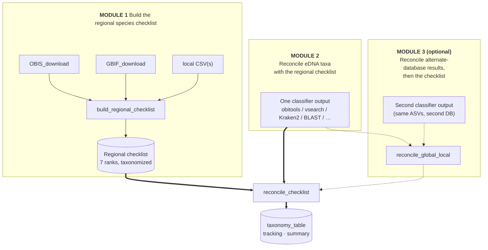

# REGATTA

<!-- badges: start -->
[](https://github.com/EWisely/REGATTA/actions/workflows/R-CMD-check.yaml)
<!-- badges: end -->

**Reconciling eDNA Geographic Assignments via Taxonomy Table Adjustment**

An R package that reconciles eDNA metabarcoding taxonomic assignments against a
regional species checklist — downgrading the taxonomic specificity of
species-level calls to taxa with no records in the study area, rather than
discarding them — without manual curation, and preserving as much taxonomic
specificity as the regional evidence supports.

## The problem

Global reference databases such as NCBI and EMBL are broad, but they are not
geographically constrained. As a result, they can confidently assign eDNA reads
to species that do not occur in the study region, even when the read belongs to
the taxonomic group targeted by the primer. For example, a fish primer may return
a confident species-level fish assignment for a species that is freshwater,
non-local, or otherwise implausible in a marine study area. This is different from
off-target amplification: the read is still within the target group, but the
species-level assignment is geographically unsupported. These calls often arise
when the true local species is absent from the reference database and the read
matches the closest sequenced relative available at the amplified marker. Lab
contamination, degraded input DNA, or other artifacts can also produce non-local
assignments.

A common workaround is to classify reads against a local reference database built
from a hand-curated regional species list. This prevents non-local species names
from appearing in the classifier output, but local databases are often specific
to an individual researcher, working group, study system, or publication. They
can be powerful, but they are not always easy to update, adapt to new regions or
primer targets, reproduce exactly, or cite in a standardized way. They also do
not solve the problem of how to interpret existing global-database assignments
that are genetically plausible but geographically unsupported.

## How REGATTA helps

REGATTA addresses both needs with the same regional checklist. First, it builds a
flexible, reproducible, and citable species list from public biodiversity
databases and optional local sources. That list can be used to build a local
reference database for future classifier runs. Second, REGATTA uses the same
checklist to reconcile global-database classifier output, retaining species-level
assignments when they are regionally supported and downgrading unsupported
assignments only as far as the checklist requires.

## The three modules

REGATTA is organized as three modules. A full REGATTA run is **Module 1 → Module
2** (one classifier) **or Module 1 → Module 3** (two classifiers) — and you can
also run **Module 1 on its own** if all you want is the regional species list.
Modules 2 and 3 share the same checklist reconciliation and are both driven by
the single `run_regatta()` entry point; **the only thing that makes Module 3
different from Module 2 is one optional extra step in front of it —
`reconcile_global_local()` (the dashed branch in the diagram below)**, which
reconciles the two databases before the shared checklist step.

**Module 1 — Build the regional species checklist.** Pull a regional species
list from public biodiversity databases (OBIS, GBIF) plus any local checklists
you supply, and resolve it to NCBI taxonomy. Run it on its own if you just want
a clean, taxonomized species list for a region × group — or as the prequel that
feeds Modules 2 and 3.
→ `build_regional_checklist()`

**Module 2 — Reconcile one classifier against the checklist.** Take the output
of your taxonomy-assignment software (obitools, vsearch, Kraken2, BLAST+LCA, …)
and reconcile it against the Module 1 checklist, walking each call up the
taxonomic tree only as far as needed for the eDNA assignment **and** the regional
range limits to agree.
→ `run_regatta(input = <one classifier output>)`

**Module 3 — Reconcile a global + a local database, then the checklist.** When
you've classified the same ASVs against both a broad global reference database
**and** a locally-curated one, reconcile the two against each other first —
keeping the coverage of the global DB and the regional fidelity of the local one
— then run that result through the Module 2 checklist reconciliation to polish
the final call.
→ `run_regatta(input = list(global = …, local = …))`

### How the reconciliation works (Modules 2 & 3)

For each assigned ASV, REGATTA finds the **lowest taxonomic rank shared between
the assignment and the regional checklist** and downgrades only that far. A
*Sebastes mystinus* call in a region that has *S. mystinus* on the checklist
stays at species. A call to *S. goodei* (a Pacific rockfish) in a region whose
checklist has other *Sebastes* but not *S. goodei* is downgraded to genus
*Sebastes* and flagged. A call to a tropical species in a temperate-region
checklist with no *Sebastes* at all is walked up the tree until something
matches, or flagged as having no regional record if nothing does.

Names on both sides — classifier output and checklist — are routed through a
**synonym-aware NCBI lookup**, so older nomenclature is updated to current
canonical taxonomy before the comparison (e.g. *Lagenorhynchus obliquidens* →
*Sagmatias obliquidens*). A synonym on either side still matches in the LCA walk.



The solid path (one classifier → `reconcile_checklist`) is **Module 2**. **Module
3** adds only the dashed branch — `reconcile_global_local` reconciles a global +
local pair first, then hands its result to the **same** `reconcile_checklist`
step. So a run is Module 1 plus either the solid path (Module 2) or the dashed
branch + solid path (Module 3).

## Installation

All dependencies are on CRAN and install automatically:

```r
# install.packages("devtools")
devtools::install_github("EWisely/REGATTA", build_vignettes = TRUE)
library(REGATTA)
```

Then read the worked examples:

```r
vignette("REGATTA-tutorial")       # Modules 1 + 2 (one classifier)
vignette("REGATTA-two-database")   # Module 3 (global + local)
```

Building the vignettes needs `pandoc` (RStudio bundles it); from a plain R
session without pandoc, drop `build_vignettes = TRUE`. Module 1 (and resolving
classifier output that isn't already in the 7 ranks) needs a local NCBI taxonomy
database — set that up first (see [Setup](#setup)); the core reconciliation on a
pre-taxonomized checklist and a pre-resolved table does not.

## Setup

A few one-time things before Module 1.

**The NCBI taxonomy database.** Everything REGATTA does to a *name* — building
the regional checklist, resolving classifier output that arrives as NCBI taxIDs
or scientific names, and updating older nomenclature to current canonical
taxonomy — runs against a local NCBI taxonomy snapshot built by `taxonomizr`.
`build_regional_checklist()`, `taxonomize_checklist()`, and any `run_regatta()`
run whose input isn't already resolved to the 7 ranks default `sql_path` to a
**persistent per-user cache** (`tools::R_user_dir("REGATTA","cache")`), shared
across projects/sessions, and build only the lightweight names+nodes (~a few
hundred MB, a few minutes — not the multi-GB accession data) on first use.
**Override** it by pointing `sql_path` at an existing DB you already have. When a
needed DB is missing they prompt to build it (interactively) or, in a script,
error with the one-line build command unless `overwrite_taxonomy_files = TRUE`.
The cache is a **snapshot** of NCBI taxonomy and is never rebuilt silently (for
reproducibility) — its build date is reported and recorded in `cl$methods`;
`overwrite_taxonomy_files = TRUE` refreshes it. Set `sql_path = NULL` in
`build_regional_checklist()` to skip taxonomizing there and defer it to
`run_regatta()`. (Only accession-based input needs the full
`taxonomizr::prepareDatabase()` build with `accession2taxid`.)

**GBIF credentials** (only if you turn GBIF on in Module 1). `GBIF_download()`
and `build_regional_checklist(GBIF = TRUE)` need a free
[GBIF account](https://www.gbif.org/user/profile) and authenticate with your
account credentials — there is no separate "API key". Add `GBIF_USER` /
`GBIF_PWD` / `GBIF_EMAIL` to your `.Renviron` (`usethis::edit_r_environ()`, then
restart R). A fresh GBIF download is an asynchronous `occ_download` that **takes
several minutes** while GBIF assembles it server-side.

**Output locations.** The two entry points — `build_regional_checklist()`
(`output_dir`) and `run_regatta()` (`out_dir`) — **require** an output directory
and write each run into its own dated `<region>_<label>_<Date>` subfolder of it,
so successive runs don't pile up. The results are also returned as R objects. The
lower-level building blocks keep their output dir **optional** so they compose
cleanly. Local checklist CSVs (each with `Genus` and `Species` columns) can live
anywhere; pass their paths to `build_regional_checklist(CSV = ...)`.

**Draw your polygon** (Module 1) at [wktmap.com](https://wktmap.com) and copy the
WKT `POLYGON ((long lat, long lat, ...))` string for the `regional_poly`
argument.

> **Tip:** check group names with `resolve_taxa()` before a long download — it
> disambiguates names against WoRMS by kingdom and flags GBIF backbone coverage.
> The shorthand `"fish"` expands to ray-finned fishes, sharks & rays, hagfishes,
> and lampreys (the typical MiFish target), and `"vertebrates"` to those plus
> mammals, birds, reptiles, and amphibians (all the vertebrate classes, so it
> works in both OBIS and GBIF). GBIF's backbone has no usable class node for bony
> fish, so `GBIF_download()` descends to order automatically — OBIS remains the
> more complete fish source, with GBIF as a supplement.

## Module 1 — Build the regional species checklist

Run once per region × group. One call downloads OBIS (default on) and/or GBIF
(default off), folds in any local CSV, taxonomizes the list, and **returns**
everything (also writing it to the required `output_dir`). Run it on its own for
a clean regional species list, or hand `cl$for_LCA` to Module 2 / Module 3.

```r
poly <- "POLYGON ((-117.4 32.0, -91.9 -6.3, -81.4 -6.3, -76.1 7.7, -82.1 8.6, -104.2 20.3, -112.5 32.2, -117.4 32.0))"

cl <- build_regional_checklist(
  region        = "galapagos",   # names the output files
  label         = "fish",        # short filename label (kept separate from taxa)
  taxa          = "fish",        # the query passed to the downloaders
  regional_poly = poly,
  OBIS          = TRUE,          # primary source (default)
  GBIF          = FALSE,         # off by default; TRUE = fresh download, or a key/object to reuse one
  CSV           = NULL,          # optional: path(s) to YOUR local checklist CSV(s),
                                 # ideally a citable published list (for reproducibility)
  marine        = TRUE, terrestrial = FALSE,
  output_dir    = "local_database_checklist",  # REQUIRED: outputs go in a dated
                                    # <region>_<label>_<date> subfolder here
  sql_path      = file.path(tools::R_user_dir("REGATTA", "cache"), "accessionTaxa.sql")
  # ^ this IS the default (a persistent cache, built on first use). Replace it
  #   with "/path/to/your/accessionTaxa.sql" to reuse an existing DB.
  #   overwrite_taxonomy_files = TRUE refreshes a stale one; sql_path = NULL skips it.
)
# cl$for_making_localdb     bare vector of unique species names, also written
#                           one-per-line to <region>_<label>_list_for_making_localdb.txt
#                           -- the ready-to-use input for a reference-DB builder like CRABS
# cl$checklist_summary      full taxonomized table with per-name resolution status (audit)
# cl$for_LCA                taxID + the 7 ranks, ready for run_regatta(checklist = cl$for_LCA)
# cl$methods                methods/provenance sentence with live citations,
#                           incl. any GBIF download key + DOI + citation (verify them)
#
# All four are returned AND written into output_dir/<region>_<label>_<date>/.
```

> **GBIF (`GBIF = TRUE`) takes several minutes** — it submits an `occ_download`
> job and waits for GBIF to build it (see [Setup](#setup) for credentials). Reuse
> a finished download by passing its key/object to `GBIF =`. Whenever GBIF is
> used (fresh or reused), its **key + DOI + citation** are folded into
> `cl$methods` — the single provenance home; always verify the citations against
> your reference manager.

**One pass per taxonomic group.** Build a separate checklist for each group your
primers target — fish with a fish-only list, crustaceans with a crustacean-only
list, and so on. This also keeps genuine *off-target amplifications* visible: a
crustacean picked up by a fish primer stands out against a fish-only checklist
instead of passing silently through a mixed megalist. Nothing in the pipeline is
fish-, marine-, or Galapagos-specific.

## Module 2 — Reconcile one classifier against the checklist

For most users the rest of the pipeline collapses to a single `run_regatta()`
call. Point it at your classifier results file and the Module 1 checklist; it
auto-detects the format, dispatches the right preprocessor, runs the checklist
reconciliation, and **returns** the final tables (also writing them under a dated
`<region>_<label>_<Date>` subfolder of `out_dir`). Pass the same `region`/`label`
you gave Module 1.

```r
# One classifier output, any tool (here an obitools .tab)
res <- run_regatta(
  input     = "data/MiFish_obi.tab",
  checklist = "local_database_checklist/my_regional_checklist.rds",
  out_dir   = "regatta_out", region = "galapagos", label = "fish"
)

# Or a vsearch lca + userout pair (LCA taxonomy + userout pct_id)
run_regatta(
  input     = c("data/vs_lca.txt", "data/vs_userout.txt"),
  checklist = "local_database_checklist/my_regional_checklist.rds",
  out_dir   = "regatta_out", region = "galapagos", label = "fish"
)

res$taxonomy_table   # final reconciled table: ASV_id, pct_id, the 7 ranks
res$tracking         # per-ASV before/after audit
res$summary          # per-stage stats summary
```

## Module 3 — Reconcile a global + a local database, then the checklist

When you have the same ASVs classified two ways, pass them as a named
`list(global =, local =)`. `run_regatta()` runs `reconcile_global_local()` first
— per ASV it keeps the call with the higher percent identity, but when the
**global** call wins yet the **local** database disagrees, it downgrades to the
lowest common ancestor of the two (a local win is kept outright) — then the
Module 2 checklist reconciliation, in one call. Roles are declared explicitly via
the list, never inferred from filenames; either side may be a vsearch
`lca + userout` pair.

```r
res <- run_regatta(
  input = list(
    global = "data/obi.tab",                          # broad global DB
    local  = c("data/vs_lca.txt", "data/vs_userout.txt")  # locally-curated DB
  ),
  checklist = "local_database_checklist/my_regional_checklist.rds",
  out_dir   = "regatta_out", region = "galapagos", label = "fish"
)
```

A two-DB run's `res$summary` has four stage columns (`global`, `local`,
`regatta_global_local_result`, `regatta_checklist_result`) so you can see what
each step changed, and `res$tracking` carries every field's global / local /
reconciled value side by side.

For fine-grained control the lower-level `reconcile_global_local()`,
`reconcile_checklist()`, and `summarize_regatta()` functions remain available;
`run_regatta()` is a thin orchestrator on top of them.

## Functions

| Function | Module | Purpose |
|---|---|---|
| `resolve_taxa()` | 1 | Validate & disambiguate query taxon names against WoRMS (by kingdom); report GBIF backbone coverage. Run standalone to pre-check names. |
| `OBIS_download()` | 1 | Pull an OBIS species list, with optional marine/brackish/freshwater filters. |
| `GBIF_download()` | 1 | Pull a GBIF species list inside a WKT polygon for given taxa. |
| `build_regional_checklist()` | 1 | **Checklist-building entry point.** Runs OBIS/GBIF + any local CSVs, taxonomizes the list, and returns `for_making_localdb` (a bare species vector + CRABS-ready file), `checklist_summary` (the full taxonomized audit table), `for_LCA` (`taxID` + 7 ranks, for Modules 2/3), and `methods` (a provenance sentence with live citations + any GBIF key/DOI). `output_dir` required. |
| `taxonomize_checklist()` | 1 | Resolve a regional list to a 7-rank NCBI taxonomy table (synonym-aware). Runs in the background from `build_regional_checklist()`; call directly only for inspection/caching. |
| `run_regatta()` | 2 / 3 | **High-level entry point for Modules 2 & 3.** Auto-detects classifier format, dispatches the preprocessor, runs the reconcile step(s), and returns `taxonomy_table` + `tracking` + `summary`. `out_dir`/`region`/`label` required. |
| `reconcile_checklist()` | 2 | **Core LCA step.** Reconcile one taxonomy table against the regional checklist. Returns `$result` / `$tracking` / `$stats`. |
| `reconcile_global_local()` | 3 | Reconcile two classifier outputs on the same ASVs: keep the higher-percent-identity call, but when the global call wins yet the local one disagrees, downgrade to the LCA of the two (a local win is kept outright). Returns `$result` / `$tracking` / `$stats`. |
| `summarize_regatta()` | 2 / 3 | The per-stage stats summary comparing inputs to outputs (counts, source breakdown, checklist membership/recovery, specificity, diversity, per-step transition + downgrade breakdown). |
| `parse_vsearch_results()` | 2 / 3 | Canonical vsearch preprocessor: join a vsearch `lca` (taxonomy) + `--userout` (pct_id) by ASV id. |
| `parse_vsearch_userout()` | 2 / 3 | Fallback parser when only a vsearch `--userout` file is available. |
| `parse_sintax()` | 2 / 3 | Convert vsearch SINTAX taxonomy strings to 7 rank columns. |
| `resolve_taxids()` | 2 / 3 | Convert NCBI taxIDs to 7 rank columns (e.g. obitools output). |
| `resolve_names()` | 2 / 3 | Convert mixed-rank scientific names (Kraken2 / BestTaxon style) to 7 rank columns; synonym-aware. |

## Output

`run_regatta()` returns a list whose primary elements are `$taxonomy_table` (the
final reconciled table), `$tracking` (the per-ASV audit — the augmented
both-stages version for a Module 3 run), and `$summary`. It writes the per-stage
`$result` + `$tracking` CSVs (no per-stage summary) — plus a single top-level
`regatta_summary.csv` and a `run_log.txt` — into the dated run subfolder of
`out_dir`.

The reconcile steps each return a list of three data frames (written as CSVs only
when given an `output_dir`):

| Element | Contents |
|---|---|
| `$result` | The REGATTA exchange format — `ASV_id`, then `pct_id` (when the input carries one, normalized to a 0–100 percent scale), then the 7 rank columns, rewritten by the reconciliation. (For a phyloseq `tax_table()`, drop `pct_id` first.) |
| `$tracking` | Per-ASV before/after audit trail (after `reconcile_global_local()`, each field's global / local / reconciled value side by side). |
| `$stats` | Aggregate counts for that stage. |

## Caveats

- **The regional checklist is only as good as its sources.** Names in your local
  CSVs that don't resolve in NCBI become inert (they can never match classifier
  output, which is also NCBI-canonical) — but they don't degrade correctness.
- **Rank set is fixed at 7 levels:** `domain`, `phylum`, `class`, `order`,
  `family`, `genus`, `species`. Subspecies and superkingdom are not used.

## Status

Ready for release. Function names and signatures are stable, and the package
is heading toward a CRAN submission and a companion methods paper.

## Authors

Eldridge Wisely (Scripps Institution of Oceanography, UC San Diego), developer
and maintainer, with contributions from Ella Crotty (OBIS and GBIF
generalizations and summary output format).

## License

MIT (see `LICENSE`).
